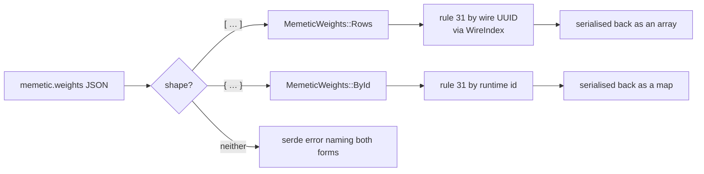

# creature: accept both memetic weight forms (GRQ #4257)

## Summary

`memetic.weights` was modelled as an id-keyed map only, so every creature
carrying NEAT-AI's **wire** form — the UUID row array — failed at the parse
boundary. That took out the whole GRQ-10 Backprop stage:
`neat_ai_backpropagation` exited 1 with
`Creature JSON error: invalid type: sequence, expected a map`, on a creature
both stacks consider valid.

Both shapes are current, and NEAT-AI writes both:

| Form | Shape | Written by |
|------|-------|------------|
| `MemeticWeights::Rows` | `[{ "fromUUID": …, "toUUID": …, "weight": … }, …]` | `src/creature/MemeticWireExport.ts` — any JSON that leaves the process |
| `MemeticWeights::ById` | `{ "<fromId>": [{ "toId": …, "weight": … }, …] }` | the in-memory `MemeticWeightsInterface` `creatureValidate` sees host-side |

`MemeticWeights` (`neat-core/src/creature.rs`) is the single home of that
either/or. It dispatches on the JSON shape via `deserialize_any` rather than an
untagged enum, so a value that is *neither* form reports both shapes it could
have been instead of serde's "did not match any variant", and it serialises back
in **whichever form was read** — the variant is the record of the shape the file
used, so the byte-identical round trip holds.

Rule 31 (`neat-core/src/creature_validate.rs`) resolves whichever form was read.
A memetic reference names its neuron in one of two vocabularies:
`resolve_memetic_reference` is the one home of that — runtime **id** for the
map form, wire **UUID** (`input-N`, `output-N`, or the stable `uuid`) for the
rows, resolved through the same `WireIndex` the synapse endpoints resolve
through (extracted from `resolve_synapse_endpoints`, so the `input-N` special
case is stated once). `biases` keys are read in both vocabularies for the same
reason: the wire exporter keys them by UUID, the in-memory record by id.

Fail-loud is preserved end to end. A reference that resolves in neither
vocabulary is still `Validation` / `MEMETIC`, so accepting both forms never
accepts a neuron that does not exist; a map value that is not an array is still
a serde error, which is the divergence
`creature_validate_conformance.rs` declares for `memetic-weights-not-an-array`;
and a creature that still cannot be parsed still fails the caller's stage.



## Evidence

Backend/library change — no web interface to screenshot.

**The reported failure, reproduced and fixed.** A scratch binary against this
crate's `parse_creature_json` + `creature_validate`, over the real GRQ-sampler
creatures (deleted after the run):

```
# before
FAIL GRQ-sampler/samples/GRQ-10-sloth.json  Creature JSON error: invalid type: sequence, expected a map at line 143217 column 13
FAIL GRQ-sampler/samples/Enceladus.json     Creature JSON error: invalid type: sequence, expected a map at line 66484 column 13

# after
OK GRQ-10-sloth.json  weights=rows  valid (connections=24092)
OK Enceladus.json     weights=rows  valid (connections=13266)
OK GRQ-13-1.json      weights=rows  valid (connections=24214)
OK GRQ-25-1.json      weights=rows  valid (connections=24214)
OK GRQ-10-1.json      weights=no memetic  valid (connections=24216)
```

Those creatures also carry UUID-keyed `biases`, so `valid` is what proves the
validator half was needed too — the parse fix alone would have left rule 31
reporting `Neuron with id <uuid> not found in the creature.`

**Mutation evidence** (AGENTS.md rule 2 — every mutation reverted before
commit), all against `tests/creature_memetic_weight_forms.rs`:

| Mutation | Result |
|----------|--------|
| `deserialize_any` → `deserialize_map` (the pre-fix behaviour) | 14 of 19 red |
| `resolve_memetic_reference` drops the wire-UUID fallback | 9 of 19 red |
| the row form serialised as an empty map | 2 red (both round-trip tests) |
| the row form skips the matching-synapse check | 1 red (`a_row_naming_two_real_neurons_with_no_synapse_between_them_is_rejected`) |

**Gates.** `./quality.sh` green (fmt, clippy `-D warnings`, `cargo test
--workspace` 229 + suites, doctests, rustdoc, release build). The consumer
builds against this checkout: `cargo build --release` in
NEAT-AI-Backpropagation is green.
`cargo check -p neat-core --target wasm32-unknown-unknown` could not run here —
`the wasm32-unknown-unknown target may not be installed` — and the change is
target-agnostic (serde, `std::collections`, `std::fmt`; no `arch` or SIMD code
touched).

## Test Plan

New — `neat-core/tests/creature_memetic_weight_forms.rs` (19 tests):

- **Parse** — the UUID row array parses into `Rows` (the reported exit 1); the
  id-keyed map still parses into `ById`; a row missing `toUUID`/`weight` still
  parses so rule 31 can report it; a map value that is not an array is still a
  parse error; a scalar `weights` fails naming both forms.
- **Round trip** — the row form is written back as an array and the map form as
  a map, each re-parsing unchanged; `ancestry` survives via `extra`.
- **Rule 31, row form** — a resolving block passes with its counters; a bias
  keyed by a wire UUID resolves; a bias key naming nothing is still rejected;
  unknown `fromUUID`, unknown `toUUID`, missing `fromUUID`, missing `toUUID`,
  missing `weight`, and two real neurons with no synapse between them each
  report their `MEMETIC` message verbatim.
- **Rule 31, map form** — still validates by runtime id, so neither form
  weakens the other.

Modified (type change, no coverage removed):

- `neat-core/tests/creature_validate_contract.rs` — reads the map through
  `MemeticWeights::by_id()`.
- `neat-core/tests/creature_validate_synapse_rules.rs` — its `weights(…)`
  fixture builds `MemeticWeights::ById`.
