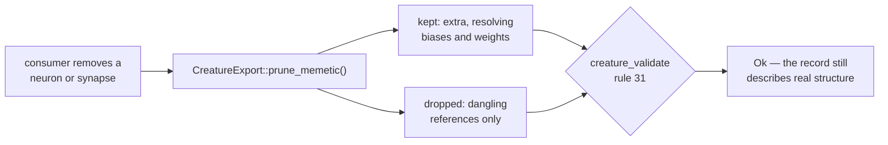

# Prune a memetic record back to live structure — rule 31's inverse

## Summary

Rule 31 (`MEMETIC`) refuses a creature whose memetic biases or weights name a
neuron or a synapse it no longer carries, so every consumer that removes
structure has to prune the record with it. There was no prune here, so each
downstream repo had to hand-roll one — and the blunt version (`memetic = None`)
throws away `MemeticExport::extra`, the `generation` / `score` / `ancestry`
history the record exists to carry.

This adds the prune beside the rule it inverts:

| Call | Use |
|------|-----|
| `CreatureExport::prune_memetic()` | prune the record the creature carries |
| `MemeticExport::prune_to(&creature)` | prune a record held separately |

Both are additive and resolve references through the **same** vocabulary rule 31
reads (`resolve_memetic_reference` / `WireIndex` / `neuron_views`: runtime id
first, then wire UUID, with implicit inputs as `input-N` and outputs forced to
`-(outputIndex + 1)`), so the prune and the rule cannot drift.

Semantics, all covered by tests:

- **Dropped:** only dangling references — a bias whose neuron is gone, a weight
  row or entry whose `(from, to)` synapse is gone, an id-keyed key that names no
  neuron.
- **Kept:** `extra` verbatim, every still-resolving delta, and the record itself
  even when it empties (`memetic = None` is a different fact).
- **Malformed ≠ dangling:** a row or entry missing `toUUID` / `toId` / `weight`
  is a defect in the record as supplied, not something a removal caused, so it
  is left for rule 31 to report rather than silently deleted.
- **No-op on append**, and **idempotent**.

Raised for [NEAT-AI-Lamarck#197](https://github.com/stSoftwareAU/NEAT-AI-Lamarck/issues/197):
Lamarck's `split_incoming_synapse` removed a synapse without pruning, rule 31
refused the rewire, the caller swallowed the error — and the whole
`structural_add_neuron` strategy silently produced nothing on exactly the
fine-tuned creatures that carry a memetic record. Lamarck ships a conservative
local prune in the meantime and will delegate to this API once it is released.

## Evidence

Backend/library change — no web interface to screenshot.

`./quality.sh` passes in full (fmt, clippy, `cargo test --workspace`, doctests,
`cargo deny`, shell and TypeScript gates, release build).

### Mutation evidence

The new tests were proven able to fail. Each mutation was applied alone to
`prune_to` and reverted afterwards:

| Mutation | Result |
|----------|--------|
| Prune keeps everything (no-op body) | 4 of 7 red — `prune_drops_the_row_naming_a_removed_edge`, `prune_follows_a_removed_neuron`, `prune_keeps_the_record_but_not_a_missing_one`, `prune_to_prunes_a_detached_record` |
| Rows pruned unconditionally (`retain(|_| false)`) | 3 of 7 red — `prune_drops_the_row_naming_a_removed_edge`, `prune_is_a_no_op_when_nothing_was_removed`, `prune_to_prunes_a_detached_record` |
| `extra` cleared during the prune (the blunt fix) | 3 of 7 red — `prune_drops_the_row_naming_a_removed_edge`, `prune_is_a_no_op_when_nothing_was_removed`, `prune_keeps_the_record_but_not_a_missing_one` |
| Unresolvable id-keyed key kept instead of dropped | 1 of 7 red — `prune_drops_dangling_map_entries_and_unresolvable_keys` |

The suite is green with every mutation reverted.

## Test Plan

New: `neat-core/tests/creature_memetic_prune.rs` (7 tests), asserting on the
record the prune hands back — `creature_validate` is the consequence, not the
only oracle:

- `prune_drops_the_row_naming_a_removed_edge` — row form; the removed edge's row
  goes, the others and both `extra` keys stay.
- `prune_drops_dangling_map_entries_and_unresolvable_keys` — id-keyed form; an
  unresolvable key goes, a live entry stays, and the entry dies with its edge.
- `prune_follows_a_removed_neuron` — a neuron removal takes its bias and every
  weight naming it.
- `prune_is_a_no_op_when_nothing_was_removed` — a pure append prunes nothing.
- `prune_keeps_the_record_but_not_a_missing_one` — an emptied record survives
  with its `extra`; a creature with no record is untouched.
- `prune_is_idempotent`.
- `prune_to_prunes_a_detached_record` — the record need not be attached.

Docs: README gains a *Pruning — rule 31's inverse* subsection with the API
table, the kept/dropped rule and a Mermaid flow.
