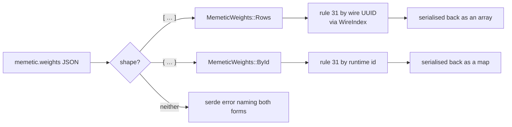

# creature: accept both memetic weight forms (downstream parse failure)

## Summary

`memetic.weights` was modelled as an id-keyed map only, so every creature
carrying NEAT-AI's **wire** form — the UUID row array — failed at the parse
boundary. That took out a whole downstream production Backprop stage:
`neat_ai_backpropagation` exited 1 with
`Creature JSON error: invalid type: sequence, expected a map`, on a creature
both stacks consider valid.

Both shapes are current, and NEAT-AI writes both:

| Form | Shape | Written by |
|------|-------|------------|
| `MemeticWeights::Rows` | `[{ "fromUUID": …, "toUUID": …, "weight": … }, …]` | `src/creature/MemeticWireExport.ts` — any JSON that leaves the process |
| `MemeticWeights::ById` | `{ "<fromId>": [{ "toId": …, "weight": … }, …] }` | the in-memory `MemeticWeightsInterface` `creatureValidate` sees host-side |

`MemeticWeights` (`neat-core/src/creature.rs`) is the single home of that
either/or. It dispatches on the JSON shape via `deserialize_any` rather than an
untagged enum, so a value that is *neither* form reports both shapes it could
have been instead of serde's "did not match any variant", and it serialises back
in **whichever form was read** — the variant is the record of the shape the file
used, so the byte-identical round trip holds.

Rule 31 (`neat-core/src/creature_validate.rs`) resolves whichever form was read.
A memetic reference names its neuron in one of two vocabularies:
`resolve_memetic_reference` is the one home of that — runtime **id** for the
map form, wire **UUID** (`input-N`, `output-N`, or the stable `uuid`) for the
rows, resolved through the same `WireIndex` the synapse endpoints resolve
through (extracted from `resolve_synapse_endpoints`, so the `input-N` special
case is stated once). `biases` keys are read in both vocabularies for the same
reason: the wire exporter keys them by UUID, the in-memory record by id.

Fail-loud is preserved end to end. A reference that resolves in neither
vocabulary is still `Validation` / `MEMETIC`, so accepting both forms never
accepts a neuron that does not exist; a map value that is not an array is still
a serde error, which is the divergence
`creature_validate_conformance.rs` declares for `memetic-weights-not-an-array`;
and a creature that still cannot be parsed still fails the caller's stage.

The `weights` field changes type, so this is **breaking** under `RELEASING.md`:
the commit carries the `feat(creature)!:` marker and the breaking-change log
records the `0.10.0` migration, which is what keeps `version-gate` from shipping
it on a patch bump.



## Evidence

Backend/library change — no web interface to screenshot.

**The reported failure, reproduced and fixed.** A scratch test against this
crate's `parse_creature_json` + `creature_validate`, over a real production
sampler fixture at the sampler tip — the creature named in the downstream
report — deleted after the run:

```
# before (this branch's merge base, Develop @ 4db5b9b)
BASELINE ERROR: Creature JSON error: invalid type: sequence, expected a map at line 139268 column 13

# after
rows=10  biases=5  neurons=2593
validate ok: ValidationStats { input: 2511, constant: 275, hidden: 2317, output: 1, connections: 24216 }
```

**The stage itself, end to end.** The same `neat_ai_backpropagation` 0.1.22
binary, rebuilt against each side, over that creature and 32 synthesised
`.bin` records:

```console
# before — sibling neat-core at Develop
$ neat_ai_backpropagation train sampler-creature.json /tmp/bp-data --epochs 1 --max-records 32 …
error: Creature JSON error: invalid type: sequence, expected a map at line 139268 column 13
EXIT=1

# after — sibling neat-core on this branch
$ neat_ai_backpropagation train sampler-creature.json /tmp/bp-data --epochs 1 --max-records 32 …
train: baseline_mse=1.015693731845 best_mse=1.015182269401 accepted_epochs=1
EXIT=0
```

That creature carries UUID-keyed `biases` (`neuron-913681343`,
`9983497c-76c2-…`) and rows whose `fromUUID` is `input-226`, so `validate ok` is
what proves the validator half was needed too — the parse fix alone would have
left rule 31 reporting `Neuron with id <uuid> not found in the creature.` A
`serde_json::Value` diff of the re-serialised creature shows the whole `memetic`
block, rows included, surviving the round trip unchanged.

**Mutation evidence** (AGENTS.md rule 2 — every mutation reverted before
commit), all against `tests/creature_memetic_weight_forms.rs`:

| Mutation | Result |
|----------|--------|
| `deserialize_any` → `deserialize_map` (the pre-fix behaviour) | 14 of 19 red |
| `resolve_memetic_reference` drops the wire-UUID fallback | 9 of 19 red |
| the row form serialised as an empty map | 2 red (both round-trip tests) |
| the row form skips the matching-synapse check | 1 red (`a_row_naming_two_real_neurons_with_no_synapse_between_them_is_rejected`) |

**Gates.** `./quality.sh` green (fmt, clippy `-D warnings`, `cargo test
--workspace` 229 + suites, doctests, rustdoc, release build). The consumer
builds against this checkout: `cargo build --release` in
NEAT-AI-Backpropagation is green, and it never reads `memetic.weights` from
Rust, so the breaking field-type change needs no code change there — only the
`neat-core.expected-version` baseline bump its CI gate wants after the
`0.10.0` release (tracked in the downstream production trainer's own backlog).
`cargo check -p neat-core --target wasm32-unknown-unknown` could not run here —
`the wasm32-unknown-unknown target may not be installed` — and the change is
target-agnostic (serde, `std::collections`, `std::fmt`; no `arch` or SIMD code
touched).

## Test Plan

New — `neat-core/tests/creature_memetic_weight_forms.rs` (19 tests):

- **Parse** — the UUID row array parses into `Rows` (the reported exit 1); the
  id-keyed map still parses into `ById`; a row missing `toUUID`/`weight` still
  parses so rule 31 can report it; a map value that is not an array is still a
  parse error; a scalar `weights` fails naming both forms.
- **Round trip** — the row form is written back as an array and the map form as
  a map, each re-parsing unchanged; `ancestry` survives via `extra`.
- **Rule 31, row form** — a resolving block passes with its counters; a bias
  keyed by a wire UUID resolves; a bias key naming nothing is still rejected;
  unknown `fromUUID`, unknown `toUUID`, missing `fromUUID`, missing `toUUID`,
  missing `weight`, and two real neurons with no synapse between them each
  report their `MEMETIC` message verbatim.
- **Rule 31, map form** — still validates by runtime id, so neither form
  weakens the other.

Modified (type change, no coverage removed):

- `neat-core/tests/creature_validate_contract.rs` — reads the map through
  `MemeticWeights::by_id()`.
- `neat-core/tests/creature_validate_synapse_rules.rs` — its `weights(…)`
  fixture builds `MemeticWeights::ById`.
