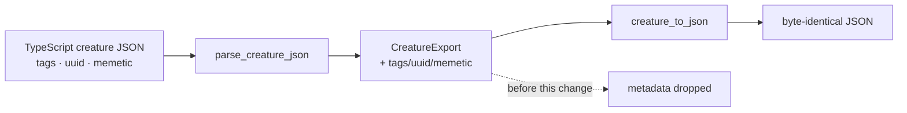

# Creature export keeps tags, uuid and memetic (NEAT-AI#3747)

## Summary

`neat-core`'s creature export structs were lossy relative to the TypeScript
wire format: `NeuronExport` and `SynapseExport` had no `tags`, and
`CreatureExport` had no top-level `uuid`, `tags`, or `memetic`. Every Rust
rewrite of a creature therefore stripped per-neuron tags (the
`intelligentDesign` "Swish -> SOFTSIGN" pedigree), per-synapse tags, and the
memetic lineage block — silently, because absence is not an error downstream.

This adds those five fields:

- `CreatureTag { name, value }` — the `@stsoftware/tags` wire shape.
- `NeuronExport::tags`, `SynapseExport::tags` — `Option<Vec<CreatureTag>>`.
- `CreatureExport::uuid`, `CreatureExport::tags`, `CreatureExport::memetic`.

Every new field is `Option` with `skip_serializing_if = "Option::is_none"` and
is declared **after** the existing fields, so a creature carrying none of them
serialises exactly as before — no new `null` keys, no key-order drift.

`memetic` is held as `serde_json::value::RawValue` (a `MemeticExport` newtype)
rather than `serde_json::Value`. This crate never interprets the block, and
`Value` is backed by a sorted map: it would re-order every UUID key on the way
out and churn the diff of any model file the Rust path rewrites. Raw text
preserves the original key order and number formatting byte-for-byte. That
required enabling the `raw_value` feature on the existing `serde_json`
dependency — no new crate.

Fixes the `neat-core` half of NEAT-AI#3747. Unknown/forward-compatible field
preservation and the Backpropagation / Lamarck consumer bumps are separate
sub-issues.

## Breaking change

Adding public fields to `CreatureExport` / `NeuronExport` / `SynapseExport`
breaks downstream exhaustive struct literals, so this ships as a
major-equivalent (minor) bump — signalled by the `!` conventional-commit
marker per `RELEASING.md`.

## Evidence

Backend-only crate change; no web interface to screenshot. Evidence is the test
suite plus the mutation runs below.

`./quality.sh` — green (`cargo fmt --check`, `cargo clippy -D warnings`,
`cargo test --workspace`, docs, release build).

### Mutation evidence

Each mutation was applied alone and reverted afterwards:

| Mutation | Expected detector | Result |
|---|---|---|
| `MemeticExport` holds `serde_json::Value` instead of `RawValue` | key-order + byte-identical tests | `roundtrip_preserves_tags_uuid_memetic`, `memetic_object_key_order_is_preserved_verbatim`, `tagged_creature_survives_a_second_roundtrip` FAILED |
| Drop `skip_serializing_if` from `CreatureExport::uuid` | no-new-`null`-keys test | `roundtrip_plain_creature_byte_identical` FAILED |
| `#[serde(skip_serializing)]` on `NeuronExport::tags` | tagged round-trip | `roundtrip_preserves_tags_uuid_memetic`, `tagged_creature_survives_a_second_roundtrip` FAILED |

The tests were also red before the implementation existed (the fields did not
compile).

## Test Plan

Added `neat-core/tests/creature/metadata_roundtrip.rs`:

- `roundtrip_preserves_tags_uuid_memetic` — a fixture with per-neuron tags,
  per-synapse tags, top-level `uuid`/`tags`/`memetic` parses with every field
  readable and re-serialises **byte-identically**.
- `roundtrip_plain_creature_byte_identical` — a fixture with none of the
  optional metadata re-serialises byte-identically and emits no `null`.
- `memetic_object_key_order_is_preserved_verbatim` — memetic keys stay in
  source order (`generation`, `score`, `biases`, `weights`), not sorted.
- `tagged_creature_survives_a_second_roundtrip` — repeated rewrites are a fixed
  point.

Modified existing tests:

- `neat-core/tests/creature/roundtrip.rs`,
  `neat-core/tests/creature_compile.rs` — struct literals gained the new
  fields (`tags: None`, `uuid: None`, `memetic: None`).
- `neat-core/tests/creature_compile.rs::test_parse_creature_json_ignores_extra_fields`
  — **documented business-logic change**: its fixture used a name-only tag
  (`{"name": "test"}`) back when `tags` was ignored entirely. `tags` is now
  parsed against the `@stsoftware/tags` contract (`name` and `value` both
  required), so the fixture carries the real wire shape. The test's intent —
  unmodelled fields such as `frozen` are ignored — is unchanged.
