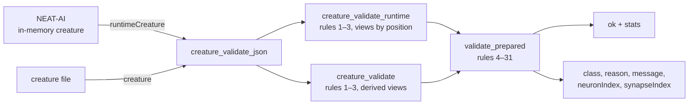

# creature_validate: accept the runtime creature shape, so a host's defect can reach the rules

## Summary

`creature_validate` crosses the WASM boundary as JSON (Issue #562), and the
creature it takes is the **export** wire form: index-free, UUID-wired, with the
input neurons implicit. That form cannot describe most of what a host is asking
about when it validates a creature it holds in memory, so the validator answers
the wrong question.

Replaying NEAT-AI's own conformance corpus (NEAT-AI#3801) through the boundary,
**11 of 55 cases disagreed with the TypeScript, four of them by accepting a
creature TypeScript rejects**:

| Case | Wire answer | TypeScript |
|------|-------------|------------|
| `neuron-missing-id` | `ok` | `no id` |
| `input-neuron-id-not-index` | `ok` | `invalid input neuron id: 5` |
| `input-neuron-past-input-count` | `ok` | `input neuron after the maximum input neurons` |
| `stats-input-count-mismatch` | `ok` | `Expected 2 input neurons found: 1` |
| `output-bias-not-finite`, `hidden-bias-nan-shadowed`, `hidden-bias-undefined-shadowed` | `MALFORMED_REQUEST: invalid type: null, expected f64` | `invalid bias: NaN` |
| `neuron-id-not-integer`, `input-count-not-integer`, `output-count-not-integer` | `MALFORMED_REQUEST: invalid type: floating point` | `invalid neuron id: -1.5` |
| `memetic-weights-not-an-array` | `MALFORMED_REQUEST: invalid type: map` | `Synapse with id 0 has invalid weights.` |

A creature carrying a `NaN` bias — the defect rule 8 exists for, and the one a
diverged training run actually produces — could not be described on the wire at
all. A validator that answers "healthy" for a creature the rules reject is worse
than no validator, so the shape a host sends has to be able to carry the defect
it is asking about.

This adds that shape. A request now names **exactly one** creature:

- `creature` — the export wire form, unchanged for every existing caller;
- `runtimeCreature` — every neuron listed (inputs included, with their own ids),
  synapses wired by array position, and permissive about the values JSON has no
  literal for (`"NaN"` / `"Infinity"` / `"-Infinity"` biases, absent fields for
  `undefined`, non-integer ids and widths, a memetic record read verbatim).

Both shapes meet at one seam — `validate_prepared` — so the rules cannot drift
between them, and the answer does not depend on how the creature was described.
Naming both keys, or neither, is a boundary fault rather than a verdict.

Unblocks NEAT-AI#3803, which cannot delete its TypeScript rules until the shared
validator agrees with them.

## Evidence

Backend/WASM change — no web interface to screenshot. The evidence is the gate.



**54 of 55 corpus cases replay exactly** through the runtime shape — same class,
same `reason`, same message text, all five counters on the happy paths. The
55th, `neuron-index-mismatch`, reads `neuron.index`, an in-memory cache that
stays host-side (NEAT-AI#3802); it is declared in `HOST_ONLY_CASES` and the test
asserts the rules still do *not* report it, so a stale declaration fails as
loudly as a mismatch. The export shape's ten divergences are untouched — that
runner still passes unchanged.

**The gate bites.** Mutating rule 4's message fails the new runner on the
offending case:

```text
neuron-missing-id: message "undefined) lacks identity" does not contain "no id"
test result: FAILED. 1 passed; 1 failed
```

**`./quality.sh` passes**, including `cargo test --workspace --doc`:

```text
🧪 Running tests...
test result: ok. 241 passed  (lib)
test result: ok. 2 passed    (creature_validate_runtime_conformance)
test result: ok. 3 passed    (creature_validate_conformance)
✅ All quality checks passed!
```

### Security self-check

- Input validation: the runtime shape is read with serde and every value the
  rules use is range- and type-checked before it indexes anything; a synapse
  naming a position no neuron occupies is `INVALID_SYNAPSE_REFERENCE`, not an
  out-of-bounds index.
- Cannot panic: the boundary keeps its no-panic contract — a payload past
  `MAX_REQUEST_NEURONS` is refused before the per-neuron allocation, and every
  other fault is a structured failure.
- No new dependency, no filesystem, shell, SQL or HTTP surface, and no internal
  state in any message.

## Test Plan

Added:

- `neat-core/tests/creature_validate_runtime_conformance.rs` — replays the
  vendored NEAT-AI#3801 corpus through the runtime shape (2 tests): every case
  matches, and the one host-only exemption is asserted to still be host-only.
- `creature_validate_runtime::tests` — 12 unit tests over the defects the export
  form cannot carry: rule 7 (input id ≠ index), rule 10 (input neuron past the
  width), rule 21 (counted inputs), rules 4 and 5 (missing and non-integer id),
  rule 8 (the three non-finite sentinels and an absent bias), rules 2 and 3
  (non-integer widths), rule 20, rule 31 (`weights` that is not an array, and
  entries missing `toId` / `weight`), a dangling synapse endpoint, and a host's
  own extra keys being ignored.
- `creature_validate_json::tests` — 4 boundary tests: a runtime creature over
  the ABI, the same defect described both ways (export says healthy, runtime
  names rule 7), exactly-one-creature-key, and the neuron ceiling.

Modified: `memetic_rules` now reads a neutral `MemeticView` both shapes map
onto, and `creature_validate` derives its views once instead of twice. No
existing test was changed or removed.
