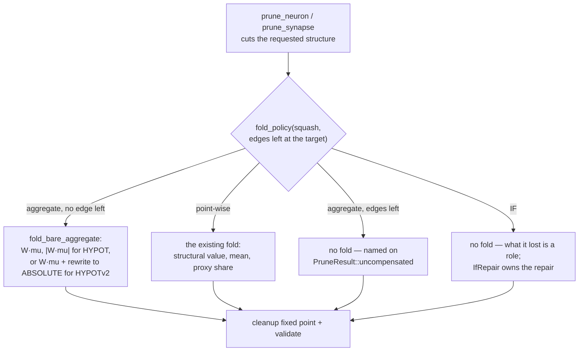

# Fold the removed term into the bias of any target left with no inward edge

Ockham issue
[stSoftwareAU/NEAT-AI-Ockham#196](https://github.com/stSoftwareAU/NEAT-AI-Ockham/issues/196),
part of the "guarantee every hidden neuron and synapse prunes" milestone (#194).

## Summary

`prune_neuron` and `prune_synapse` refused a bias fold to **every** aggregate
target and named it on `PruneResult::uncompensated`. That is right only while
the target still has terms to aggregate. Once the cut leaves a target with **no
inward edge**, the forward pass evaluates it from its bias alone
(`prune_cleanup::zero_inward_activation`) — a point-wise reading again — so the
fold is the closest creature there is.

`prune_neuron::fold_policy(target_squash, remaining_inward_edges)` is the single
rule both entry points now ask, so a neuron removal and a synapse removal can
never disagree about what a target is owed. The shape of the fold follows the
empty form:

The shape of the fold per squash is tabulated once, in the `prune_neuron`
module documentation, and mirrored in `README.md`'s pruning section — this
summary points at it rather than keeping a third copy that could drift.

`IF` is excluded whatever it is left with: what it lost is a role, and
`IfRepair` owns that repair. `HYPOTv2` is the one place a target's squash
changes; the two forms share the `[0, f32::MAX]` activation range, asserted in
the tests rather than assumed.

## Evidence

A library change with no visual surface, so the evidence is the test suites and
the quality gate rather than a screenshot.

- `./quality.sh` is green: `cargo fmt --check`, clippy `--workspace
  --all-targets --all-features -- -D warnings`, `cargo test --workspace
  --all-features`, rustdoc under `-D warnings`, cargo-deny, markdownlint and
  the bats shell-harness suite.
- The prune suites grow from 36 to 46 tests (`prune_synapse`) and 40 to 46
  (`prune_neuron`). Every new case asserts `Ok`, `creature_validate` +
  `validate_creature_topology`, and the compiled output on at least three probe
  records to 1e-6 relative.
- The behaviour is genuinely new, not already-passing coverage: the aggregate
  cases were written first and observed failing against the unfixed code
  (`MINIMUM fold: expected -0.95, got 0.25`, `HYPOT fold: expected 1.45, got
  0.25`, and `Unknown squash function` before the `HYPOTv2` name was right),
  then pass after it.
- `stSoftwareAU/NEAT-AI-Ockham`, the registered downstream consumer this issue
  came from, compiles and passes its full suite against `0.16.0` with no source
  edit.

## Version

`[workspace.package].version` `0.15.7 → 0.16.0`. No public item changed, but
documented pruning behaviour callers rely on did, which is a major-equivalent
bump pre-1.0 per `RELEASING.md`. The breaking-change log carries the entry and
the migration note, including the `AggregateTarget → NoStatistics` reason-code
move that reaches the JSON and WASM surface. Ockham moves its
`neat-core.expected-version` baseline in the matching PR.

`wasm-bench/Cargo.lock` moves too. It was pinned at `0.15.0` — two minors stale
— so this bump also brings that lockfile back in step; nothing else in it
changed.

## Test plan

`neat-core/tests/prune_synapse.rs`

- `an_output_left_with_no_inward_edge_takes_the_mean_fold` (corner case 1)
- `an_output_left_with_no_inward_edge_folds_a_constant_source_exactly` (2)
- `an_output_left_with_no_inward_edge_folds_an_observation_source` (3)
- `a_summing_aggregate_output_left_with_no_inward_edge_takes_the_fold` — `MINIMUM`, `MAXIMUM`, `MEAN` (11)
- `a_hypot_output_left_with_no_inward_edge_folds_the_absolute_term` (11)
- `a_hypot_v2_output_left_with_no_inward_edge_becomes_an_absolute` (11), which
  also asserts `apply_limit_range` clamps `HYPOTv2` and `ABSOLUTE` identically
- `a_hidden_aggregate_left_with_no_inward_edge_becomes_a_support_constant`
- `a_bare_aggregate_with_no_statistic_is_still_reported_uncompensated` — the
  error path: foldable is not the same as having something to fold
- `a_bare_aggregate_folds_a_structurally_fixed_source_exactly` — a constant
  source needs no statistic and a supplied mean does not override it
- `a_bare_aggregate_reports_the_residual_its_form_can_justify` — `W² σ²` for the
  summing forms and for `HYPOTv2`, whose fold is linear; `None` for `HYPOT`,
  whose fold is a magnitude; `Some(0.0)` for a structurally fixed source
- `an_aggregate_target_with_an_edge_left_is_never_given_a_bias_fold` — the
  renamed, narrowed former `an_aggregate_target_is_never_given_a_bias_fold`

`neat-core/tests/prune_neuron.rs`

- `the_sole_source_of_two_outputs_folds_into_both_biases` (4)
- `only_the_output_that_loses_its_last_edge_goes_constant` (5)
- `an_aggregate_target_left_with_no_inward_edge_takes_the_fold` — the same rule
  reached from the other caller
- `an_if_left_with_no_inward_edge_is_still_never_given_a_bias_fold` — the rule
  12 exclusion at zero edges, which only a neuron removal can reach because
  `IfRepair::Rewrite` restores an emptied role before a synapse removal can
- `a_removed_aggregate_folds_its_mean_into_each_target_like_any_other_source`
- `twelve_identity_neurons_prune_one_by_one_without_moving_the_mean_output` —
  the golden acceptance test

Every new test asserts `Ok`, `creature_validate` + `validate_creature_topology`,
and the compiled output on at least three probe records to 1e-6 relative. The
expected numbers are derived in the test from the documented forward-pass forms,
never read back out of the code under test.

`cargo test --workspace --all-features`, `cargo clippy --workspace --all-targets
--all-features -- -D warnings` and `./quality.sh` are green.
