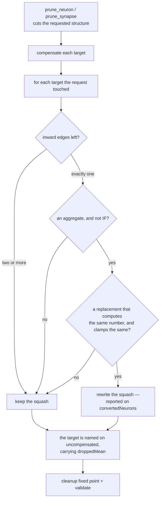

# An aggregate that keeps inward edges: one-edge conversion, and the dropped term's magnitude

Ockham issue
[stSoftwareAU/NEAT-AI-Ockham#197](https://github.com/stSoftwareAU/NEAT-AI-Ockham/issues/197),
part of the "guarantee every hidden neuron and synapse prunes" milestone (#194).

## Summary

A cut takes one term out of a target's sum. Where the target aggregates, no bias
fold stands in for that term, so `prune_neuron` / `prune_synapse` named the
target on `PruneResult::uncompensated` and left it exactly as it was. Two things
were missing from that answer, and both are about what the cut *left behind*:

- **An aggregate left with one inward edge is no longer aggregating.** Reducing a
  single term is that term, so the squash can be rewritten to the point-wise one
  that computes the same number. `neat-core/src/prune_rewrite.rs` is that rule —
  `MINIMUM`/`MAXIMUM`/`MEAN` to `IDENTITY`, `HYPOTv2` (and `HYPOT` at bias `0`)
  to `ABSOLUTE`, bias unchanged — reported on `PruneResult::converted_neurons`
  and `convertedNeurons` on the wire. Every rule is read off the matching arm of
  `CompiledNetwork::activate`, so each is exact and `transform` is untouched.
  `HYPOT` at a non-zero bias is **kept**: it adds its bias to the root where
  `ABSOLUTE` folds it inside, so the two agree only at `0`, and the `HYPOT` is
  already exact as it stands. `IF` is never converted — it reads its condition
  sum to pick a branch, and `IfRepair` owns what a lost role means (rule 12).
- **The term that went now has a reported magnitude.**
  `UncompensatedTarget::dropped_mean` (`droppedMean`) is `weight_sum · μ` where
  the caller supplied statistics and `weight_sum · a` where the creature itself
  fixes the source's activation — the same precedence the compensation takes —
  and `None` where neither proves a number, so no magnitude is invented.

**No magnitude refuses a prune.** `dropped_mean` is reported so the caller's
scorer can judge the loss; nothing here compares it against a threshold.
Statistics this crate cannot make sense of are a different matter and still
refuse outright.

The rewrite runs after the cut and before `cleanup_creature*`, over the targets
the **request itself touched** and nothing else: cleanup owns the canonical form
of the rest, which is why `neat-core/tests/prune_parity.rs` and the TypeScript
captures are untouched by this change.

The forward pass puts every activation through `apply_limit_range`, so a rule is
only taken when the replacement clamps identically — the guard is in
`prune_rewrite::clamps_identically`, and a rule whose clamp moved is skipped
rather than applied.

## Evidence

A library change with no visual surface, so the evidence is the test suites and
the quality gate rather than a screenshot.

- `./quality.sh` is green: shellcheck, bats, `cargo fmt --check`, clippy
  `--workspace --all-targets --all-features -- -D warnings`, `cargo test`,
  rustdoc under `-D warnings`, cargo-deny, markdownlint and the Deno suites.
- `neat-core/tests/prune_parity.rs` passes unchanged — no parity fixture carries
  a non-`IF` aggregate, so the TypeScript captures are untouched.
- `deno test --allow-read tests/wasm_prune_parity_test.ts`: 15 passed.
- The golden record was regenerated with
  `UPDATE_PRUNE_GOLDEN=1 cargo test -p neat-core --test prune_json` and gains two
  cases, `single_edge_aggregate_converted` and
  `aggregate_keeps_its_squash_with_two_edges`, which are what carry
  `convertedNeurons` and `droppedMean` over the wasm comparator.
- `scripts/check-downstream-consumers.sh --workspace ..` compiles Ockham against
  this core (the only consumer checked out in the worker's workspace). The change
  is additive: a new module, a new public struct, and new fields on
  `PruneResult` / `UncompensatedTarget` / `PruneResponse` / `UncompensatedJson`.
  No registered consumer names `PruneResult`, `UncompensatedTarget`,
  `prune_neuron` or `prune_synapse` outside Ockham, and Ockham only reads those
  fields, so nothing can be broken by a struct gaining one. Patch bump,
  `0.15.9 → 0.15.10`.

### Oracles

- **The aggregate form itself.** Each conversion claims a single-edge aggregate
  and its point-wise replacement are the same function, so the converted
  creature is activated against the cut creature **still declaring the
  aggregate squash**, built in the test by a plain `retain`. The two sides run
  down different arms of `CompiledNetwork::activate`, so a fault in either moves
  one of them.
- **Arithmetic derived in the test.** `expected_single_edge_output` computes what
  the fixture's output must be from the documented forward-pass arms, in `f64`,
  and every probe record is graded against it within `1e-6` relative.
- **The refusal is load-bearing.** `HYPOT` at a non-zero bias is pinned as kept
  *and* shown to differ from the `ABSOLUTE` rewrite on the probe records, so the
  bias-`0` condition cannot be deleted and stay green.

## Test Plan

`neat-core/tests/prune_synapse.rs`

- `a_minimum_maximum_or_mean_left_with_one_edge_becomes_identity`
- `a_hypot_at_zero_bias_and_a_hypot_v2_become_absolute`
- `a_hypot_with_a_non_zero_bias_keeps_its_squash`
- `an_if_left_with_one_edge_is_never_converted`
- `a_converted_target_folds_its_last_edge_exactly`
- `an_aggregate_left_with_two_edges_keeps_its_squash_and_reports_the_dropped_term`
- `the_dropped_term_magnitude_is_reported_only_where_a_number_proves_it`
- `no_dropped_magnitude_refuses_a_prune`
- `unusable_statistics_still_refuse_an_aggregate_prune`
- `the_replacement_clamps_every_converted_activation_the_same_way`

`neat-core/tests/prune_neuron.rs`

- `an_aggregate_the_removal_leaves_with_one_edge_becomes_point_wise`
- `a_hypot_adding_a_non_zero_bias_survives_a_neuron_removal_unrewritten`
- `the_dropped_term_magnitude_crosses_with_the_uncompensated_target`
- `an_aggregate_left_reducing_two_terms_keeps_its_squash`
- `no_dropped_magnitude_refuses_a_neuron_removal`

`neat-core/tests/prune_json.rs`

- `a_conversion_and_a_dropped_magnitude_both_cross_the_wire`
- `a_report_with_no_conversion_and_no_magnitude_omits_both_keys`
- `the_golden_record_is_what_the_native_abi_answers_today` (regenerated record)

`neat-core/src/prune_rewrite.rs` unit tests

- `every_aggregate_has_a_considered_answer`
- `a_point_wise_squash_is_never_replaced`
- `a_replacement_whose_clamp_moved_is_refused`

## Merge note

The pushed `issue-196-zero-edge-bias-fold` branch restructures the same
aggregate branch of `prune_neuron` / `prune_synapse` (it introduces
`fold_policy` and its own `inward_edge_count`). This branch is cut from
`Develop`, as Ockham #197 states no dependency, so the two overlap textually:
whichever lands second should route `prune_rewrite`'s private
`inward_edge_count` at the shared `prune_neuron::inward_edge_count` rather than
keeping two.
