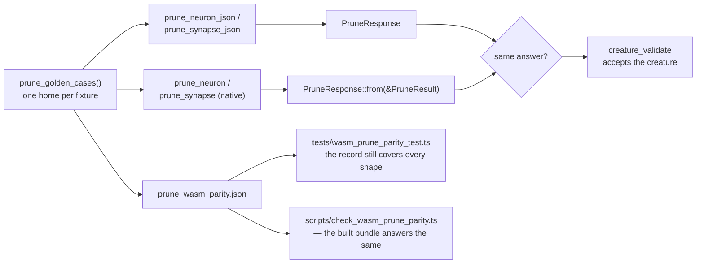

# Every pruning corner case crosses the JSON / WASM boundary unchanged

Ockham issue
[stSoftwareAU/NEAT-AI-Ockham#201](https://github.com/stSoftwareAU/NEAT-AI-Ockham/issues/201),
part of the "guarantee every hidden neuron and synapse prunes" milestone (#194).

## Summary

Corner cases 1–12 of the pruning guarantee were graded natively by
`prune_neuron.rs` / `prune_synapse.rs` and nowhere else. Ockham's native calls
and NEAT-AI's `WasmPruneNeuron.ts` both reach the rewrites through
`prune_neuron_json` / `prune_synapse_json`, so a shape that crossed that
boundary wrongly — a dropped report list, a lost conversion — would have reached
a host with nothing failing. Each of the twelve now has a named golden case and
a named test that drives it through the JSON entry point **and** the native
call and asserts the two answer the same `PruneResponse`.

- **`impl From<&PruneResult> for PruneResponse` is public.** It was the private
  `PruneResponse::from_result`, so a test could only spot-check a field at a
  time; comparing the two answers whole is what catches a payload the boundary
  silently dropped.
- **`prune_json::prune_golden_cases` gains ten cases**, one per shape the
  record did not already carry: the last edge into an output from a hidden
  source, from a **constant** and from an observation; one removal leaving two
  outputs bare and one leaving only one of several bare; an **output** carrying
  `IF` repaired in place; a removal with no statistics at all; the
  `HYPOTv2 → ABSOLUTE` one-edge conversion; every aggregate squash left with no
  inward edge in a single request; and a three-deep hidden chain collapsing on
  one cut. The remaining two corner cases were already recorded
  (`single_edge_aggregate_converted`,
  `aggregate_keeps_its_squash_with_two_edges`). Regenerated with
  `UPDATE_PRUNE_GOLDEN=1 cargo test -p neat-core --test prune_json`; no
  previously recorded answer moved except the one the fix below changes.
- **A zero-edge `HYPOTv2 → ABSOLUTE` rewrite is now reported.**
  `fold_bare_aggregate` rewrote the target's squash and pushed no
  `SquashConversion`, so a consumer reading the report was told about the
  single-edge conversion (Ockham #197) and not about this one — while
  `prune_rewrite` documents the report as being there precisely so "a caller
  never has to discover it". `TargetOutcome::Folded` now carries the rewrite
  and both entry points collect it into `PruneResult::converted_neurons`
  alongside the single-edge conversions. Found by driving the shape across the
  wire, which is what this issue is for.
- **One home per fixture.** The five creatures the native suites and the
  golden record would otherwise have kept two copies of now live only in
  `prune_golden_cases`, read by `neat-core/tests/prune_neuron.rs` /
  `prune_synapse.rs` through the new `tests/common/golden_fixture.rs`. The
  cross-surface claim ("the wire answers what the native call answers for this
  shape") is only worth anything while both halves are graded on the *same*
  creature, which is the same reason `tests/common/prune_if.rs` exists;
  `OUTPUT_IF_JSON` moved out of it for that reason.
- **The coverage gates fail on a record that stops covering a shape.**
  `the_golden_record_covers_the_shapes_the_wasm_bundle_is_graded_on` now
  requires a non-empty `convertedNeurons`, an `uncompensated` entry carrying
  `droppedMean`, both arms of the conversion table (`MINIMUM → IDENTITY` and
  `HYPOTv2 → ABSOLUTE`), and each of the twelve cases by name.
  `tests/wasm_prune_parity_test.ts` asserts the same from the Deno side, which
  is what `wasm-bundle.yml` grades the built bundle with.

## What the wire/native comparison does and does not prove

`crosses_unchanged` asserts the parsed wire answer equals
`PruneResponse::from(&native_result)`. Both sides run that same conversion, so
the equality pins the **round trip** — a filled list a `skip_serializing_if`
drops, a `Serialize`/`Deserialize` rename that does not agree with itself, a
number JSON does not carry back — and **not** the rewrite: a fault in
`prune_neuron` moves both sides together. That is why each corner case also
asserts the value the documented forward-pass form requires (`W · μ` into a
bias, `|W · μ|` for a `HYPOT`, the squash a conversion lands on), derived in
the test rather than read back out of the answer, and why the committed record
compared against the built bundle stays the boundary gate. The mutation table
below is the evidence for both halves, and the module docs and `README.md` now
say this rather than claiming more.

## Why the Ockham #196 branch is merged here

`origin/issue-196-zero-edge-bias-fold` was pushed but its PR was never opened —
the worker could not authorise the cross-repo target and escalated on the Ockham
issue — so `fold_policy`, the zero-edge fold and the `HYPOTv2 → ABSOLUTE`
rewrite are absent from `Develop`. Corner case (11) *is* that rule, so this
branch merges #196 rather than reimplementing it. The conflicts are resolved
semantically: the module docs keep the #197 and #198 sections and gain the #196
one, the bare-aggregate `NoStatistics` entry carries #197's `dropped_mean`, and
the two native test files take `Develop`'s copy plus #196's additions.

`RELEASING.md`'s #198 entry is retitled `0.16.0 → 0.17.0`, which is the version
it actually shipped as: its branch was cut at `0.15.9` and claimed `0.16.0`,
#197 took that slot first, and the auto-bump moved #198 to `0.17.0` on merge.
The two entries are reordered so the log still descends. The #196 entry takes
`0.18.0`, the next slot, and the workspace version moves with it. The
completeness gate (`tests/scripts/releasing_breaking_change_log.bats`) is what
surfaced the gap, and `pr-summary-ockham-196.md` — written for a PR that was
never opened, against a `Develop` at `0.15.7` — now says which version its rule
actually ships as rather than the one it guessed.

## Evidence

A library change with no visual surface, so the evidence is the suites and the
gate rather than a screenshot.

- `./quality.sh < /dev/null` — `✅ All quality checks passed!`, exit 0,
  including clippy `-D warnings`, `cargo test --workspace`, the doctests,
  rustdoc, the Mermaid gate, `deno test --allow-read tests/wasm_prune_parity_test.ts`
  (16 passed) and the 590-case bats shell harness.
- `cargo test -p neat-core --test prune_json` — 27 passed, of which twelve are
  the new corner cases.
- `cargo test -p neat-core` — every binary green, `prune_neuron` 55,
  `prune_synapse` 60, lib 289.

### Mutation evidence — the new tests can fail

Every mutation was run with `cargo test -p neat-core --no-fail-fast` (without
it, `cargo test` stops at the first failing binary and under-reports), and each
was reverted after the run. Tests that died:

| Mutation | Tests that went red |
|---|---|
| `fold_bare_aggregate`: `folds_a_magnitude` → `false`, so a `HYPOT` folds the signed term | `a_hypot_output_left_with_no_inward_edge_folds_the_absolute_term`, `a_bare_aggregate_reports_the_residual_its_form_can_justify`, `corner_case_11_…`, `the_golden_record_is_what_the_native_abi_answers_today` |
| `zero_edge_rewrite(HYPOTv2)` → `None`, so a bare `HYPOTv2` keeps a squash that never reads its bias | `a_hypot_v2_output_left_with_no_inward_edge_becomes_an_absolute`, `an_aggregate_target_left_with_no_inward_edge_takes_the_fold`, `corner_case_11_…`, `the_golden_record_…` |
| the zero-edge rewrite is performed but **not reported** (the defect this PR fixes) | the same four |
| `From<&PruneResult>`: `converted_neurons` → `Vec::new()`, so the boundary drops the conversion report | `corner_case_8_…`, `corner_case_9_…`, `corner_case_11_…`, `a_conversion_and_a_dropped_magnitude_both_cross_the_wire`, `the_golden_record_…` |
| `add_to_bias` made a no-op — the helper Ockham #196 collapsed the two identical bias-writing loops into, so both former sites must die | 13 of 55 `prune_neuron`, 14 of 60 `prune_synapse`, 7 of 27 `prune_json` |
| the committed record stripped of `convertedNeurons` and every `droppedMean` | `the_golden_record_covers_the_shapes_the_wasm_bundle_is_graded_on` — "no golden case carries a non-empty convertedNeurons" |

The fourth row is the shared-path caveat made concrete: the corner cases that
died are the ones carrying a derived assertion about the conversion, not the
equality assertion, which moved with the fault.

## Test plan

`neat-core/tests/prune_json.rs`

- `corner_case_1_the_last_edge_into_an_output_folds_the_callers_mean`
- `corner_case_2_the_last_edge_from_a_constant_folds_exactly`
- `corner_case_3_the_last_edge_from_an_observation_folds_the_callers_mean`
- `corner_case_4_the_sole_source_of_two_outputs_folds_into_both`
- `corner_case_5_only_the_output_that_loses_its_last_edge_goes_bare`
- `corner_case_6_an_output_carrying_if_is_rewritten_in_place`
- `corner_case_7_a_prune_with_no_statistic_reports_what_went_uncompensated`
- `corner_case_8_an_aggregate_left_with_one_edge_becomes_identity`
- `corner_case_9_a_hypot_v2_left_with_one_edge_becomes_absolute`
- `corner_case_10_an_aggregate_left_with_two_edges_reports_the_dropped_term`
- `corner_case_11_every_aggregate_left_with_no_inward_edge_takes_the_fold`
- `corner_case_12_one_cut_collapses_a_three_deep_hidden_chain`
- `the_golden_record_covers_the_shapes_the_wasm_bundle_is_graded_on` — extended

`neat-core/tests/prune_synapse.rs` / `prune_neuron.rs`

- `a_hypot_v2_output_left_with_no_inward_edge_becomes_an_absolute` and
  `an_aggregate_target_left_with_no_inward_edge_takes_the_fold` — each gained
  the assertion that the zero-edge rewrite is **reported**, which is what
  failed against the unreported version
- `a_summing_aggregate_output_left_with_no_inward_edge_takes_the_fold` — gained
  the negative half: a form that reads its bias needs no rewrite, so none is
  reported
- five fixtures now read through `tests/common/golden_fixture.rs`; no assertion
  changed with them

`tests/wasm_prune_parity_test.ts`

- `the golden record reaches both entry points and both answer shapes` —
  extended with `convertedNeurons`, `droppedMean` and both conversion arms
- `the golden record carries every corner case the pruning guarantee is stated
  in` — new
