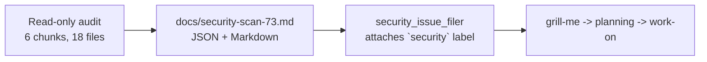

## Summary

Static, read-only security audit of `stSoftwareAU/NEAT-AI-core` per issue #73.
No source code under audit was modified — the only file added by this PR is the
audit report itself at `docs/security-scan-73.md`, which carries the JSON block
consumed by the downstream `security_issue_filer` plus a Markdown summary for
human reviewers. Closes #73.

Six findings survived triage:

| ID | Class | Severity | Where |
|----|-------|----------|-------|
| `a1c4ne01` | `supply-chain:quarantine-misconfigured` | High | `.github/workflows/ci.yml:59-112` |
| `b2c4ne02` | `supply-chain:quarantine-misconfigured` | High | `.github/workflows/upgrade-dependencies.yml:30-79` |
| `c3d5ne03` | `supply-chain` (action tag pinning) | Medium | every workflow except `markdown-lint.yml` |
| `d4e6ne04` | `supply-chain` (`curl \| sh` installer) | Medium | `.github/workflows/wasm-bundle.yml:28-29` |
| `e5f7ne05` | `memory-safety` (unchecked SIMD `get_unchecked`) | Medium | `neat-core/src/simd_native.rs:83-334` |
| `f6g8ne06` | `supply-chain` (local `quality.sh` bypass) | Low | `quality.sh:58-66` |

Headline risk is the documented 24h crates.io quarantine in `bump-deps.sh`
being bypassed by the per-PR `version-increment` job and the weekly
`upgrade-dependencies.yml` cron, both of which call `cargo upgrade`/`cargo update`
directly instead of delegating to `bump-deps.sh`.

## Evidence

CLI / docs-only change — no UI to screenshot and no runtime behaviour change.
Evidence is the audit report at `docs/security-scan-73.md`. The report cites
each finding by file path and line range and quotes the offending code.

## Test Plan

This PR adds no executable code and changes no behaviour, so no unit tests
were added or modified. Verification is by inspection of the audit report
and by the downstream `security_issue_filer` parsing the embedded JSON block.

- [ ] Reviewer confirms `docs/security-scan-73.md` opens with a valid
  `mythos-security-scan/v1` JSON block.
- [ ] Reviewer spot-checks each cited file/line range matches the quoted
  evidence.
- [ ] `quality.sh` continues to pass — this PR touches only files under
  `docs/`, which `ci.yml` skips via `paths-ignore`.
