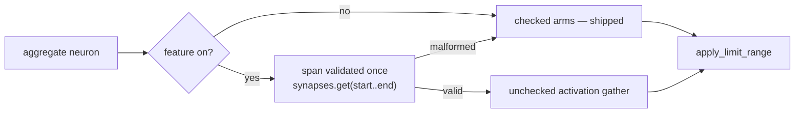

# Unchecked aggregate inference kernels — experiment record (Issue #510)

**Status: negative result. The prototype was measured, rejected and removed.**

An experiment, not a change: it asked whether removing the per-synapse bounds
check from the `Minimum`, `Maximum` and `If` aggregate inference loops buys
anything on a production-sized creature. It does not, and the record below says
why so the lever is not re-attempted.

## Hypothesis

The standard weighted-sum path already reads the activation buffer with
`get_unchecked` under the load-time `from_index < num_neurons` invariant
(`CompiledNetwork::new`, see [`AGENTS.md`](../../AGENTS.md) *"Load-time index
validation is the soundness precondition for `get_unchecked`"*). The aggregate
paths still index `activations[from_index]` checked, once per synapse. If that
bounds check costs real time, extending the same invariant to the three
aggregate kernels should show up as end-to-end inference throughput on a
production creature.

The issue itself flagged the risk up front: aggregates may be too rare in real
creatures for an isolated kernel win to matter. That turned out to be only half
the story — the kernel win is not there either.

## Aggregate frequency in production creatures

The real production `network.json` is **not committed** and is not on the build
host (a standing limitation recorded in
[`BASELINE.md`](../../neat-core/benches/BASELINE.md)), so the distribution could
not be measured directly. Three committed sources bracket it:

| Source | Evidence | Implied Min/Max/If frequency |
| --- | --- | --- |
| `CompiledNetwork::new` trace-buffer sizing (`neat-core/src/network.rs`, Issue #1173) | *"Estimate ~10% of neurons have aggregate functions (MINIMUM, MAXIMUM, IF)"* | ~10% |
| NEAT-AI activation registry (`src/methods/activations/Activations.ts`) | 39 registered activation classes; `MINIMUM`, `MAXIMUM`, `IF` are 3 of them (all six aggregates including the deprecated `HYPOT`/`HYPOTv2`/`MEAN` are 6 of 39) | ~7.7% if mutation samples the registry uniformly |
| Benchmark fixtures (`neat-core/benches/common/mod.rs`) | `production` / `production_2x` / `production_exact` are homogeneous `Tanh` | 0% |

The registry share is an unweighted upper estimate — `Activations.allowedSquashes`
can restrict the pool for a given run — but it lands within a factor of ~1.3 of
the crate's own committed assumption. **~10% is the working figure**, and the
benchmark sweep brackets it with 0 / 10 / 50 / 100%.

## What was implemented and measured

Prototype (commit `107633a`, since reverted), behind the non-default
`experimental-aggregate-unchecked` feature:

- `aggregate_forward_unchecked` / `aggregate_traced_unchecked` — the three
  aggregate kernels with the activation gather through `get_unchecked`;
- `aggregate_forward_safe` / `aggregate_traced_safe` — the checked controls,
  copies of the shipped arms;
- **two attribution controls**, both fully safe: `aggregate_forward_safe_indexed`
  (walks `start..end` and indexes the synapse array, the form `activate` /
  `activate_into` ship) and `aggregate_traced_safe_span` (walks the span as a
  slice with `enumerate`). Without these, an "unchecked is faster" reading
  cannot be separated from "slice iteration is faster".

The span precondition was discharged **once per neuron** with
`synapses.get(start..end)`; a malformed span falls back to the checked
reference and still panics, so bad data is never read out of bounds. The
`from_index` precondition is the existing load-time invariant.

Wiring: `neuron_activation_scalar` (the batched scoring/loss single-record
home), `CompiledNetwork::activate`, `activate_into` and `activate_and_trace`.

## Method

- Host: Apple M4 Pro (12 cores), 24 GB, macOS 26.6, `rustc 1.97.0`
  (`aarch64-apple-darwin`), Criterion 0.8.2, `--release` bench profile.
- Base commit `804c40b`; build flags: default plus
  `--features experimental-aggregate-unchecked` for prototype sessions.
- Fixture: `production_exact` — 2,461 inputs, 1,666 non-input neurons, exactly
  21,513 synapses (avg fan-in 12.9), with a deterministic, evenly-spread
  fraction of neurons rewritten to `Minimum`/`Maximum`/`If`. Topology, weights
  and biases are untouched, so aggregate **frequency** is the only swept
  variable.
- Training data: `PRODUCTION_SCORING_RECORDS` = 4,096 records × 2,461 f32
  columns (~40 MiB) — one production shard, the calibration documented in
  `BASELINE.md`.
- Warm-up 2 s, measurement 8 s, 100 samples (20 for the scoring group).
- Isolated kernels: safe and unchecked arms measured **in the same process**, so
  the A/B is not a cross-session artefact. Three repeat sessions; medians below.
- End-to-end: control and prototype are separate builds, so they were run as
  alternating whole sessions (control, prototype, prototype, control).
- **Null control:** the `agg0pct` configuration contains no aggregate neurons, so
  the prototype build executes byte-identical work there. Its measured
  session-to-session delta *is* the noise floor of this host.

## Result 1 — the host's noise floor is enormous, so read deltas against the null control

The `agg0pct` configuration runs byte-identical work in both builds. Its
measured spread *is* the noise:

| Group | Control sessions (`agg0pct`) | Prototype sessions (`agg0pct`) | Spread |
| --- | --- | --- | --- |
| `aggregate_forward_pass` | 29.76, 29.99, 32.53 µs | 34.27, 41.53 µs | **39.6%** |
| `aggregate_traced` | 33.27, 32.32, 36.06 µs | 39.53, 42.55 µs | **31.7%** |
| `aggregate_scoring` | 34.72, 35.84, 41.46 ms | 38.70, 36.30 ms | **19.4%** |

Raw before/after numbers on this host are therefore meaningless on their own —
whole sessions drift by up to 40%. Every delta below is **normalised within its
own session** against `agg0pct` before the builds are compared, which cancels
the session-level drift.

## Result 2 — end-to-end, production-sized creature

Median of 3 control sessions vs 2 prototype sessions, each normalised to its
session's `agg0pct` null control:

| Group | Aggregate frequency | Control median | Prototype median | Normalised delta |
| --- | --- | --- | --- | --- |
| `aggregate_forward_pass` | 0% (null control) | 29.99 µs | 37.90 µs | — (defines 1.000) |
| `aggregate_forward_pass` | **10% (production)** | 25.60 µs | 29.87 µs | **−3.4%** |
| `aggregate_forward_pass` | 50% (synthetic) | 32.26 µs | 34.14 µs | −14.7% |
| `aggregate_forward_pass` | 100% (synthetic) | 36.83 µs | 29.10 µs | −37.6% |
| `aggregate_traced` | 0% (null control) | 33.27 µs | 41.04 µs | — |
| `aggregate_traced` | **10% (production)** | 27.71 µs | 33.57 µs | **−4.8%** |
| `aggregate_traced` | 50% (synthetic) | 38.28 µs | 41.12 µs | −13.8% |
| `aggregate_traced` | 100% (synthetic) | 43.81 µs | 46.04 µs | −17.3% |
| `aggregate_scoring` (4,096 records) | 0% (null control) | 35.84 ms | 37.50 ms | — |
| `aggregate_scoring` | **10% (production)** | 85.88 ms | 88.82 ms | **−1.3%** |
| `aggregate_scoring` | 50% (synthetic) | 119.28 ms | 103.14 ms | −16.7% |
| `aggregate_scoring` | 100% (synthetic) | 173.24 ms | 132.30 ms | −19.7% |

At the production-realistic ~10% frequency the deltas are **−1.3% to −4.8%**,
an order of magnitude inside a 19–40% noise floor and inside the spread between
two *same-build* control sessions. The 14–38% gains appear only at 50% and 100%
aggregate frequency — synthetic fixtures that exist to prove the harness can
detect a difference at all.

## Result 3 — the isolated kernels say the win is not bounds-check removal

Isolated A/B in one process over all 1,666 neurons (21,513 gathers per
iteration), median of 3 sessions. `safe` is the shipped form; `safe_indexed`
and `safe_span` are the fully safe attribution controls:

| Kernel | `safe` | `safe_indexed` / `safe_span` (safe) | `unchecked` | Unchecked vs the *safe* control |
| --- | --- | --- | --- | --- |
| forward `Minimum` | 17.55 µs | 16.69 µs | 16.45 µs | −1.4% |
| forward `Maximum` | 17.78 µs | 16.53 µs | 14.71 µs | −11.0% |
| forward `If` | 39.88 µs | 36.60 µs | 40.82 µs | **+11.5% (slower)** |
| traced `Minimum` | 22.77 µs | 18.63 µs | 16.69 µs | −10.4% |
| traced `Maximum` | 24.87 µs | 17.87 µs | 17.70 µs | −1.0% |
| traced `If` | 41.95 µs | 39.00 µs | 37.30 µs | −4.4% |

Two things fall out:

1. **The direction is not consistent.** `If` gets *slower* unchecked on the
   forward path while `Maximum` gets faster; run-to-run spread on a single arm
   reached 14%, which covers the whole range.
2. **Most of the traced improvement is available safely.** Going from `safe`
   (which indexes `synapses[start + local_idx]`) to `safe_span` (which iterates
   the validated slice) captures 18%, 28% and 7% respectively — *without any
   `unsafe`*. The unchecked gather adds at most another few percent, within
   noise.

The forward `Minimum` case is the cleanest evidence: `neuron_activation_scalar`
already iterates a slice, and there the unchecked gather buys −1.4% — nothing.

## Result 4 — the real production lever is aggregate *frequency*, not the kernel

The sweep surfaced something an order of magnitude larger than anything the
prototype could reach. Scoring one production shard (4,096 records) through the
same creature, control build:

| Aggregate frequency | Scoring time | vs 0% |
| --- | --- | --- |
| 0% | 35.84 ms | 1.0× |
| 10% | 85.88 ms | **2.4×** |
| 50% | 119.28 ms | 3.3× |
| 100% | 173.24 ms | 4.8× |

`score_batch_into` dispatches on `has_aggregate_squash()`, which is `true` if
**any** neuron is an aggregate. A creature that is 90% standard-squash therefore
loses the record-interleaved fast path for *all* of its neurons, not just the
aggregate ones. That 2.4× dwarfs the ≤5% the bounds checks were ever worth.
Filed separately as
[#514](https://github.com/stSoftwareAU/NEAT-AI-core/issues/514) — it is not in
scope for this experiment.

## Decision — rejected and removed

The acceptance gate required a meaningful, repeatable gain on a
production-sized workload at a realistic aggregate frequency. It was not met:

| Gate condition | Outcome |
| --- | --- |
| Production-sized workload improves above noise | ❌ −1.3% to −4.8% at 10%, against a 19–40% noise floor |
| Gain repeats across runs | ❌ isolated kernels flip sign per squash type between runs |
| Benefits a realistic aggregate frequency | ❌ gains appear only at 50–100% aggregate |
| Numerical and trace parity | ✅ bit-identical (forward, traced, hints, trace buffer) |
| Malformed data still rejected safely | ✅ span validated per neuron; `InvalidSynapseIndex` still rejects at load |
| Tests and CI pass | ✅ |
| Safety/maintenance cost proportionate | ❌ four `unsafe` gathers and a duplicated kernel set for ≤5% inside noise |

Matching the issue's explicit reject conditions: *improvements exist only in
aggregate-heavy synthetic benchmarks* and *results are neutral, noisy or
slower*. The prototype was reverted; the crate keeps its checked aggregate
loops.

**Cause of the negative result** — not one thing, in this order of importance:

1. **The bounds check is not the cost.** The activation gather is a dependent,
   scattered load into a 4,127-element buffer; the `cmp`/`jae` pair costs
   nothing next to it and the branch is perfectly predicted (it never fires).
   LLVM also hoists part of it out of slice-iterating loops already.
2. **What little there was is an iteration-style effect, not a safety
   effect** — `safe_span` recovers most of the traced gain with no `unsafe`.
3. **Aggregate frequency is too low for it to matter end-to-end.** Even a
   hypothetical 30% kernel win on ~10% of neurons is a couple of percent
   overall, which this host cannot resolve.

## What was kept

- `neat-core/benches/aggregate_frequency.rs` — the aggregate-frequency sweep,
  the only committed fixture that puts aggregate neurons in a production-sized
  creature (the `production*` fixtures are homogeneous `Tanh`). It is what
  Result 4 is reproducible from, and its `agg0pct` point doubles as a null
  control for future A/B work on this host.
- This record.

Everything else — the prototype module, its feature, the four wiring sites and
the parity test — was reverted. The prototype is preserved in the branch history
(commit `107633a`) for anyone who wants to re-run it.

## Do not re-attempt without

- a **real varied-squash production creature** (the committed fixtures cannot
  show this), and
- a **quiet host**: a 19–40% session noise floor cannot resolve a ≤5% effect. Pin
  clocks or use many more alternating sessions.

Even then, spend the effort on the Result 4 dispatch cliff instead: it is worth
~2.4× on the same workload the aggregate kernels are ≤5% of.

## Deliverables checklist

- [x] Safe reference and isolated prototype
- [x] Explicit constructor/kernel invariants
- [x] Forward and trace parity coverage
- [x] Aggregate-frequency measurements from production-sized creatures
- [x] Production-sized benchmark results
- [x] Written conclusion
- [x] Prototype removed (acceptance gate not met)
