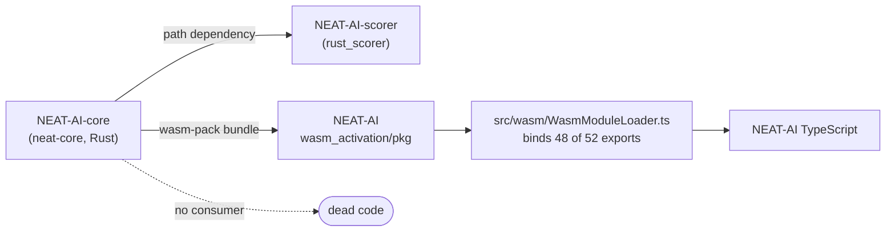

# Dead-code audit — NEAT-AI, NEAT-AI-scorer, NEAT-AI-core (2026-07-29)

Issue [#413](https://github.com/stSoftwareAU/NEAT-AI-core/issues/413). Report
only — every confirmed finding is filed as an issue in the repository that owns
the code, and each cleanup rides its own per-repo PR. No code is removed here.

## Scope and method

"Dead code" for this audit means any of: symbols or files with zero references,
redundant `export` / `pub` keywords, stale `#[allow(dead_code)]` items, and
unused dependencies.

Each candidate was checked against **every** consumer, not just its own
repository. `neat-core` is consumed two ways — as a `path` dependency by
`rust_scorer`, and as a WASM bundle by NEAT-AI's TypeScript — so a Rust symbol
is only dead when both paths come up empty.

`WasmModuleLoader.ts` binds every live WASM export by literal property access —
there is no dynamic `module[name]` lookup anywhere in `src/wasm/` — so an export
with no binding line has no caller.

The sibling repositories NEAT-AI-Discovery, NEAT-AI-Examples and NEAT-AI-Explore
were also swept for symbol-level references to `neat-core`; they only mention it
in prose and CI checkout steps, so they do not keep any candidate alive.

## Findings

### NEAT-AI-core (Rust)

| Issue | Finding | Weight |
| --- | --- | --- |
| [#414](https://github.com/stSoftwareAU/NEAT-AI-core/issues/414) | `PredictiveCodingEngine` (`pc_inference.rs`, `pc_learning.rs`) has no caller in NEAT-AI or NEAT-AI-scorer; NEAT-AI implements predictive coding in TypeScript. Ships in the WASM bundle regardless. | 912 src + 1,099 test lines |
| [#415](https://github.com/stSoftwareAU/NEAT-AI-core/issues/415) | `wasm_dataset.rs` and its seven `training_data_*` exports were never adopted by `Learn.ts`; the milestone (#295) and upstream adoption issue (NEAT-AI#3410) are both closed. | 722 src + 435 test lines |
| [#416](https://github.com/stSoftwareAU/NEAT-AI-core/issues/416) | Four WASM exports have no binding in `WasmModuleLoader.ts`: `derivative_batch_4way`, `calculate_error_batch_4way`, `get_training_state_num_neurons`, `get_training_state_num_synapses` — plus the two native `apply_*_4way` functions the first two wrap. | 4 of 52 exports |
| [#417](https://github.com/stSoftwareAU/NEAT-AI-core/issues/417) | `apply_squash_f64` and `apply_limit_range_f64` carry a stale `#[allow(dead_code)]`, have test-only callers, and their doc comments name a compiled-network caller that no longer exists. | 2 functions |
| [#418](https://github.com/stSoftwareAU/NEAT-AI-core/issues/418) | `deny.toml.test` is tracked at the repository root and referenced by nothing. | 1 file |

### NEAT-AI (TypeScript / Deno)

| Issue | Finding | Weight |
| --- | --- | --- |
| [#3509](https://github.com/stSoftwareAU/NEAT-AI/issues/3509) | Orphan barrel modules `src/creature/mod.ts`, `src/neuron/mod.ts`, `src/workers/mod.ts` — zero importers, outside the `mod.ts` graph. | 150 lines |
| [#3510](https://github.com/stSoftwareAU/NEAT-AI/issues/3510) | `EvolveHardware.ts`, `EvolveImprovementMilestones.ts` and `SanitiseCompactVariant.ts` are imported only by their own test; the first two have live successors. | 263 lines |
| [#3511](https://github.com/stSoftwareAU/NEAT-AI/issues/3511) | 24 value-level exports are referenced only inside their defining file — the `export` keyword is redundant. | 24 of 1,822 exports |
| [#3512](https://github.com/stSoftwareAU/NEAT-AI/issues/3512) | `TOPOLOGY_MALFORMED_BUFFER` and `STRUCTURAL_MALFORMED_BUFFER` in `src/wasm/WasmTopologyOps.ts` have no reference at all. | 2 constants |

A further 114 `interface` / `type` exports are single-file too, but several are
cited in `docs/api/*.md` as documented public shapes; separating the documented
from the incidental ones is left out of #3511 deliberately.

### NEAT-AI-scorer (Rust)

| Issue | Finding | Weight |
| --- | --- | --- |
| [#474](https://github.com/stSoftwareAU/NEAT-AI-scorer/issues/474) | 27 `pub` items are crate-internal and should be `pub(crate)`. Verified by downgrading all 27 in a throwaway copy: `cargo check`, `cargo clippy -- -D warnings` and `cargo test` all stayed green. | 27 items |
| [#475](https://github.com/stSoftwareAU/NEAT-AI-scorer/issues/475) | `src/main.rs:13-21` declares its own copy of the module tree instead of `use rust_scorer::…`, compiling a second copy of every module. That duplication is why all 16 `#[allow(dead_code)]` sites are load-bearing and why a dozen `pub` markers cannot be tightened. | root cause |

No unreferenced `pub` item, no unreferenced file and no unused dependency was
found in `rust_scorer` — every `pub` has a real consumer and all 9 dependencies
are referenced. Stripping all 16 `#[allow(dead_code)]` attributes produced 19
`dead_code` errors, every one of them in the `bin` target, so not a single
attribute is stale on its own terms.

Two judgement calls were **left in place** rather than filed:

- `src/cost.rs:132` `CostKind::from_cli` (with `:30 InvalidCostName` and
  `:341 supported_list`) is called only from `#[cfg(test)]` code and doctests —
  the bin parses `--cost` through clap's `ValueEnum`. The comment at
  `cost.rs:127-130` states it is a deliberate public library API for
  `NeatOptions.costName`, re-verified in the Issue #470 audit. Removing it would
  keep the gate green but break a documented contract.
- `src/gpu/mod.rs:217` `ScoringPath::SingleCreature` is constructed only under
  `#[cfg(test)]`; all production sites are match arms. Keeping the variant for
  enum completeness is defensible.

Stale doc-comment references in `rust_scorer` to `neat_core::batch_scoring`,
`neat_core::synapse_type`, `SynapseData`, `reset_state`, `activate`,
`apply_squash` and `apply_limit_range` are noted in #475 — they are a
documentation-accuracy problem rather than dead code.

## Explicitly cleared (not dead)

- **NEAT-AI worker entry points** — `src/workers/workerEntryPoint.ts`,
  `src/multithreading/workers/deno/worker.ts`,
  `src/multithreading/episode/episodeWorker.ts` and
  `src/intelligentDesign/workers/deno/worker.ts` sit outside the `mod.ts` static
  graph but are loaded through `new Worker(new URL(...))`.
- **`src/utils/Statistics.ts`** — outside the `mod.ts` graph, live via `bench/`.
- **`src/deprecated/{HYPOT,HYPOTv2,MEAN}.ts`** — live via
  `src/methods/activations/Activations.ts` and
  `src/compact/SimplifyLargeWeights.ts`.
- **`neat-core` sibling 4-way exports** — `accumulate_weight_batch_4way`,
  `accumulate_bias_batch_4way`, `calculate_weight_batch_4way` and
  `calculate_bias_batch_4way` are all bound in `WasmModuleLoader.ts`; only the
  four listed in the findings are unbound.
- **NEAT-AI dependencies** — all 12 external and all 25 path entries in
  `deno.json` `imports` have at least one importer. Lowest live counts:
  `@std/bytes` (1), `@std/uuid` (1), `@connectionOptions` (1).
- **`neat-core` dependencies** — `serde`, `serde_json`, `rayon`, `tempfile` and
  `criterion` are each referenced from source, tests or benches.
- **`neat-core` public types** — no `pub struct` / `enum` / `trait` / `const` in
  `neat-core/src` came back with zero references.
