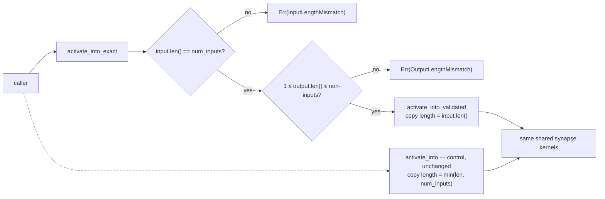

# Validated exact-size inference entry point — experiment record (Issue #511)

**Status: neutral result. The prototype was measured, rejected and removed.**

An experiment, not a change: it asked whether validating the input and output
dimensions **once** at the public boundary — and then running a hot path that
assumes them — buys measurable end-to-end inference throughput on a
production-sized creature. It does not, and the reason is visible in the
generated code before any timer is started.

## Hypothesis

Every single-record entry point derives its copy length defensively:

```rust
let input_len = input.len().min(self.num_inputs);
self.activations[..input_len].copy_from_slice(&input[..input_len]);
```

Production observations are a fixed width equal to `num_inputs`. Establishing
that once at the boundary should let the optimiser drop the `min`, drop the
partial-fill possibility, and expose a stronger length fact to everything
downstream — with a typed error instead of a silent truncation as a bonus.

## What was implemented

Prototype (commit `f3652d7`, since reverted), behind the non-default
`experimental-exact-inference` feature:

- `activate_into_exact(&mut self, input, output) -> Result<(), NetworkError>` —
  the safe public boundary. Rejects `input.len() != num_inputs`
  (`NetworkError::InputLengthMismatch`) and an output buffer that is empty or
  longer than `num_neurons - num_inputs`
  (`NetworkError::OutputLengthMismatch`). Both checks run before any write, so
  a rejected call leaves the network and the caller's buffer untouched.
- `activate_into_validated` — the internal hot path, `#[inline]`, identical to
  the shipped `activate_into` except that the copy is
  `self.activations[..input.len()].copy_from_slice(input)`.
- The control (`activate_into`) untouched, and still the only production entry
  point.

**No `unsafe` and no unchecked indexing.** "Validated" here means *the caller's
shapes were checked once*, not *bounds checks were removed*; the issue's
prohibition on unchecked indexing behind a "validated" name was taken
literally, and the codegen result below is the reason that mattered.



## Method

- Host: Apple M4 (`Mac16,13`), macOS 26.6, `rustc 1.97.1 (8bab26f4f 2026-07-14)`
  (`aarch64-apple-darwin`), Criterion 0.8.2, Node 25.6.1 for the wasm runtime.
  **The host is shared and was loaded throughout** — 1-minute load average 11–15
  on a 10-core machine. Every conclusion below is stated against a measured
  noise floor, not against a raw before/after pair.
- Base commit `7d45817`; prototype commit `f3652d7`. Native builds: default
  release profile, plus `--features experimental-exact-inference`. Wasm builds:
  `wasm32-unknown-unknown`, `RUSTFLAGS="-C target-feature=+simd128,+relaxed-simd"`,
  `opt-level=3`, `lto=true`, `codegen-units=1`.
- Fixture: `production_exact` — 2,461 inputs, 1,666 non-input neurons, exactly
  21,513 synapses, 1 output; the committed production creature topology.
- Records: `PRODUCTION_SCORING_RECORDS` = 4,096 × 2,461 f32 (~40 MiB), one
  production shard at the real observation width (see
  [`BASELINE.md`](../../neat-core/benches/BASELINE.md)).
- Native: `neat-core/benches/exact_inference.rs` (at `f3652d7`; reverted with
  the prototype), both arms in **one process**.
  Criterion warm-up 3 s, ≥5 s measurement, 100 samples (20 for the
  4,096-record group). Eight sessions.
- Wasm: `wasm-bench/run-exact.sh` (at `f3652d7`; reverted with the prototype),
  reusing the Issue #509 interleaved driver unchanged —
  both modules instantiated in one Node process, alternating sample by sample
  with the order flipped each sample, statistic = **paired median ratio**.
- **Null controls everywhere.** Native: a `control_b` arm running byte-identical
  work to `control`. Wasm: the `score` and `kernel` benches (unaffected by the
  switch) plus whole runs of *control against itself*. A delta smaller than the
  null control's is noise.

## Result 1 — the codegen says there was never anything to win

Release asm for both functions from one `--emit asm` build
(`codegen-units=1`, `aarch64-apple-darwin`):

| | `activate_into` (control) | `activate_into_exact` (prototype) |
| --- | ---: | ---: |
| Instructions in the function body | 1,268 | **1,305** (+37) |
| `panic_bounds_check` call sites | 12 | **12** |
| `slice_index_fail` call sites | 2 | **2** |
| `memcpy` calls | 2 | 2 |
| Stack frame | 224 B | 240 B |

**Not one bounds check was removed.** The prologues show why:

```text
control:    ldr x26,[x0,#416] ; cmp x26,x2 ; csel x8,x26,x2,lo   ← the min: one csel, branchless
            ldr x19,[x0,#64]  ; cmp x8,x19 ; b.hi <panic>        ← destination bound
            bl _memcpy

prototype:  ldr x9,[x0,#416]  ; cmp x2,x9  ; b.ne <InputLengthMismatch>
            ldr x11,[x0,#408] ; sub x10,x4,#1 ; sub x9,x11,x22 ; cmp x10,x9 ; b.hs <OutputLengthMismatch>
            ldr x19,[x0,#64]  ; cmp x22,x19 ; b.hi <panic>        ← still there
            bl _memcpy
```

The entire theoretical saving is the control's `min` — **one `csel`**, already
branchless. The prototype does not even bank it: the destination-slice bound is
still checked, and two validation branches are added in front. The "stronger
length fact" is not propagated into the neuron loop at all, because the neuron
loop never depended on the input length; it is bounded by `num_neurons` and
`num_synapses`, which LLVM already knew.

Binary size moved the wrong way, on both targets:

| Artefact | Control | Prototype | Delta |
| --- | ---: | ---: | ---: |
| `libneat_core.rlib` (native release) | 3,478,512 B | 3,511,560 B | **+33,048 B (+0.95%)** |
| `wasm_gather4_bench.wasm` | 672,497 B | 682,819 B | **+10,322 B (+1.5%)** |

## Result 2 — native, production-sized end-to-end: unresolvable, consistent with zero

`exact_record_throughput`: 4,096 production-width records through the per-record
entry point, one iteration = one full shard. Eight sessions, ms per iteration:

| Session | `control` | `exact` | `control_b` (null) |
| --- | ---: | ---: | ---: |
| 0 | 205.10 | 213.02 | 216.31 |
| 1 | 206.33 | 207.45 | 205.94 |
| 2 | 165.19 | 337.44 | 210.06 |
| 3 | 204.79 | 197.40 | 224.34 |
| 4 | 182.62 | 163.92 | 94.40 |
| 5 | 181.87 | 194.33 | 182.00 |
| 6 | 294.48 | 197.81 | 190.92 |
| 7 | 197.88 | 185.55 | 183.69 |
| **Median** | **201.34** | **197.61** | **198.43** |

Complete records/second at the median: **20,344** (control), **20,728**
(prototype), **20,642** (null control).

The prototype lands 1.9% below `control` and 0.4% below `control_b` — but
`control` and `control_b` run **byte-identical code** and their per-session
ratio ranges from 0.79 to 1.94. Session 4 is the clearest statement of the
problem: the same function measured 182.62 ms and 94.40 ms in the same process,
minutes apart. On this host the native harness cannot resolve anything smaller
than tens of percent.

The single-forward-pass group is worse still and is reported only to record that
it is unusable: `control` 43.02 µs vs `control_b` 69.87 µs in the same
session — 62% apart on identical work, against a prototype `exact` reading of
37.90 µs that means nothing.

## Result 3 — wasm, paired A/B: ≤0.3%, inside the identical-code floor

The Issue #509 interleaved driver resolves far better than Criterion on this
host, because the two modules take turns inside one process. `activate` is the
only bench that differs between the modules; `score` and `kernel` compile
identically in both and are therefore in-run null controls. Paired median ratio,
prototype ÷ control (<1 = prototype faster):

| Run | Sessions × samples | `activate` (differs) | `score` (null) | `kernel` (null) |
| --- | --- | ---: | ---: | ---: |
| Real A/B 1 | 3 × 15 | 0.9981 | 1.0000 | 1.0370 |
| Real A/B 2 | 5 × 25 | 0.9924 | 0.9982 | 0.9730 |
| Real A/B 3 (alternated with null) | 6 × 25 | 1.0014 | 1.0649 | 0.9986 |
| **Null A/B 1** (control vs control) | 3 × 15 | 1.0014 | 1.0002 | 0.9998 |
| **Null A/B 2** (control vs control) | 5 × 25 | 1.0009 | 0.9848 | 1.0010 |
| **Null A/B 3** (control vs control, alternated) | 6 × 25 | 1.0024 | 0.9894 | 0.9996 |

Median across the three real runs: **0.9981**. Median across the three
identical-code null runs: **1.0014**. The corrected effect is therefore about
**0.3% faster**, and it does not survive contact with its own spread:

- Real-run `activate` ratios span 0.9924 → 1.0014 — a 0.9% swing between runs of
  the *same* comparison.
- Null-run per-session `activate` ratios span 0.9756 → 1.0398 for **identical
  code**, so a single session reading 0.988 proves nothing.
- Run 2 looked promising in isolation (5/5 sessions below 1.0, median 0.9924);
  run 3, deliberately alternated with a null run under heavier load, returned
  1.0014 while its null returned 1.0024.

Numerical parity was **bit-identical** in every wasm run (the driver compares
`f64` checksums), and in the native parity tests.

For scale: one record through the per-record entry point costs ~40.5 µs on wasm,
while the batched `score_records_flat` path — what production training actually
runs — costs ~8.9 µs per record. A 0.3% shave on the slower, non-dominant entry
point is not where production inference time is.

## Result 4 — the exact contract is not compatible with current callers

Independent of performance, the stronger contract does not fit the crate as it
stands:

- `packed_record_scan` (`loss.rs`, Issue #444) activates each record as
  `&records[base..base + input_size]`, where `input_size` is **caller-supplied**
  and explicitly permitted to be narrower than `num_inputs`.
- `load_record` (`batch_scoring.rs`, Issue #445) is built on the same
  permission: it copies `min(record.len(), num_inputs)` and zero-fills the
  uncovered slots.

An exact-size entry point would reject those calls. Adopting it means changing
the record-width contract of every loss and scoring entry point — a far larger
change than the issue authorises, for a benefit measured at ≤0.3%.

A compiled network also does not record its own output count (outputs are the
last `output.len()` activations), so "exact output size" is not checkable at
all; the prototype could only validate `1 <= output.len() <= num_neurons -
num_inputs`.

## Result 5 — the error behaviour is genuinely better, and that is not a perf result

The prototype's error handling is clearer than the control's:

| Call | Control | Prototype |
| --- | --- | --- |
| `input.len() < num_inputs` | silently truncates; uncovered input slots keep whatever the **previous** call left there | `Err(InputLengthMismatch)`, nothing written |
| `input.len() > num_inputs` | silently ignores the tail | `Err(InputLengthMismatch)` |
| `output.len() > num_neurons` | panics on subtraction overflow | `Err(OutputLengthMismatch)` |
| `output.is_empty()` | fills nothing, reports success | `Err(OutputLengthMismatch)` |

The first row is a real semantic asymmetry: after a full-width call, a shorter
follow-up call leaves the earlier call's values in the input slots it does not
cover (`activate_into` never zero-fills, unlike `load_record`). Per the issue's
instruction this is **not** counted as evidence for the performance change and
is not fixed here — it is filed separately as
[#519](https://github.com/stSoftwareAU/NEAT-AI-core/issues/519).

## Decision — rejected and removed

| Gate condition | Outcome |
| --- | --- |
| Production-sized end-to-end throughput improves meaningfully above noise | ❌ ≤0.3% on wasm against a ±1% inter-run floor; unresolvable natively |
| The result is repeatable | ❌ real-run ratios 0.9924 / 0.9981 / 1.0014 across three runs of the same comparison |
| The stronger shape contract is acceptable for real callers | ❌ `packed_record_scan` / `load_record` rely on narrower-than-`num_inputs` records |
| Numerical parity and all tests pass | ✅ bit-identical on native and wasm |
| Error handling clearer or no worse | ✅ clearer — but no measurable performance follows from it |
| No supported production target materially regresses | ⚠️ +0.95% native rlib, +1.5% wasm module, and a duplicated forward pass to maintain |
| Code remains evolutionary and low-risk | ❌ a second copy of the forward loop that must be kept bit-identical to the first |

The gate is not met, so the prototype was reverted. Matching the issue's own
reject condition: *the benefit is visible only as codegen bulk and an API
preference, and is lost in end-to-end production measurement.*

**Cause of the neutral result**, in order of importance:

1. **The defensive length logic is one branchless `csel` per call.** Against
   ~21,513 synapse gathers per forward pass (~40 µs), a single instruction is
   ~0.002% — below any harness's resolution and below the noise of a shared
   host by four orders of magnitude.
2. **The invariant buys no bounds-check elision.** The destination-slice check
   survives, and the neuron loop never depended on the input length. The
   optimiser had already extracted everything that was there.
3. **The validation itself costs more than the `min` it replaces** — two extra
   branches, +37 instructions, +33 KB of native code.
4. **Copying dominates the boundary anyway.** The input copy is a 9,844-byte
   `memcpy`; how its length was computed is irrelevant next to moving the bytes.

## What was kept

- This record.
- Issue [#519](https://github.com/stSoftwareAU/NEAT-AI-core/issues/519) — the
  stale-input semantics of `activate_into`, discovered here and deliberately
  separated from the performance question.

Everything else — the prototype module, its feature, the two `NetworkError`
variants, the parity/error tests, the Criterion A/B bench and the wasm-bench
`exact-inference` arm — was reverted. The prototype is preserved in the branch
history (commit `f3652d7`) for anyone who wants to re-run it:
`git show f3652d7`.

## Do not re-attempt without

- a **quieter host**. The native Criterion harness measured a 0.79–1.94×
  spread on identical code; nothing below ~20% is decidable there. The wasm
  paired driver reaches ~±0.3% per run but still swings ~1% between runs.
- a **reason grounded in codegen, not in style.** Read the asm first: if the
  check you are removing is a `csel` that survives in the "optimised" form
  anyway, there is no experiment to run.
- a **decision about caller record widths.** The exact contract cannot be
  adopted while the loss and scoring entry points are documented to accept
  records narrower than `num_inputs`.

## Deliverables checklist

- [x] Safe exact-size prototype and unchanged control path
- [x] Explicit dimension-error tests
- [x] Production caller/parity validation
- [x] Native/WASM codegen inspection
- [x] Production-sized benchmark evidence
- [x] Written neutral conclusion
- [x] Prototype removed (acceptance gate not met)
