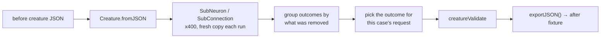

# Pruning parity matrix — TypeScript behaviour to Rust fixture (Issue #588)

The canonical pruning rewrite engine (Issue #587) moves NEAT-AI's removal
semantics out of TypeScript and into `neat-core`. Step 1 of that migration is
this matrix: every battle-tested TypeScript behaviour that a shared Rust helper
must reproduce, mapped to the fixture that captures it and the test that pins
it.

Nothing here prunes yet. The fixtures are the acceptance oracle the helpers
(Issues #590 / #591) are graded against —
`prune(case.before(), case.request) == case.after()` — and until those helpers
exist the captured pairs are checked against the rules they obey.

## Where the behaviour lives

| Side | Home |
|------|------|
| Fixtures | `neat-core/src/prune_fixtures.rs` — `PRUNE_PARITY_CASES` |
| Tests | `neat-core/tests/prune_parity.rs` |
| TypeScript source | NEAT-AI `src/mutate/`, `src/compact/`, `src/architecture/` |

Each `PruneCase` carries its own provenance as data — `ts_source`, `ts_test`,
`rule` — so the mapping below is generated from the fixtures rather than
maintained beside them.

## The matrix

| Rust fixture | Behaviour captured | TypeScript source | TypeScript test | Rust test |
|---|---|---|---|---|
| `CASCADE_ORPHAN_FEEDERS` | removing a neuron removes every feeder the removal orphans, to a fixed point | `src/mutate/SubNeuron.ts`, `src/compact/OrphanedNeuronCleanup.ts` | `test/mutate/SubNeuronCascadeOrphan.ts` | `removing_a_neuron_cascades_through_every_orphaned_feeder` |
| `EDGE_TARGET_BECOMES_CONSTANT` | a hidden target with no inward edge left but an outward one becomes a constant, `bias = squash(bias)` | `src/mutate/SubConnection.ts` | `test/mutate/SubConnection.ts` | `a_target_that_loses_its_last_inward_edge_folds_its_squash_into_a_constant` |
| `EDGE_SOURCE_BECOMES_DEAD` | a hidden or constant source left with no outward edge is removed | `src/mutate/SubConnection.ts` | `test/mutate/SubConnectionStaleFromIndex.ts` | `a_source_left_with_nothing_to_feed_is_removed` |
| `EDGE_ROLE_IDENTITY` | only the requested `(from, to, role)` triple is removed, not every edge of the pair | `src/mutate/SubConnection.ts`, `src/architecture/SynapseKey.ts` | `test/creature/TypedSynapseKey.ts` | `removing_one_role_keeps_the_other_role_of_the_same_pair` |
| `IF_REPAIR_COALESCES_ROLES` | an `IF` missing a required role is downgraded to `IDENTITY`, roles stripped, coalesced rows summed | `src/architecture/RepairInvalidIfNeurons.ts`, `src/architecture/CoalesceInwardSynapses.ts` | `test/NEAT/MutatorForwardOnlyIFConditionsRepair.ts`, `test/fix/IfRoleAssignmentCoalesce.ts` | `an_if_that_loses_a_role_is_downgraded_and_its_rows_are_summed` |
| `CONSTANT_MOVES_INTO_PREFIX` | after a hidden→constant flip the slice is re-ordered constants-then-hiddens and the synapses re-sorted | `src/architecture/NormaliseComputationalNeuronOrder.ts` | `test/compact/CompactKeepOrder.ts` | `a_converted_constant_moves_ahead_of_the_hidden_neurons` |
| `MEMETIC_DROPPED_ON_REMOVAL` | a successful removal drops the content-derived identity: `uuid` and `memetic` | `src/compact/OrphanedNeuronCleanup.ts`, `src/mutate/SubNeuron.ts` | `test/architecture/StaleUuidAfterStructuralChange.ts` | `a_memetic_record_naming_removed_structure_is_dropped_whole` |
| `CONSTANT_BIAS_FOLD` | compensation folds `w · meanActivation` of the removed neuron into each target's bias | `src/architecture/ErrorGuidedStructuralEvolution/DiscoveryNeuronRemoval.ts` | `test/ErrorGuidedStructuralEvolution/DiscoveryOperationIntegrity.ts` | `the_constant_bias_fold_leaves_the_creature_scoring_identically` |

Four rules hold across **every** case rather than belonging to one, and are
asserted over the whole slice:

| Rule | Rust test |
|---|---|
| a successful rewrite never returns an invalid creature | `every_captured_pair_is_a_creature_the_shared_validator_accepts` |
| no orphan survives — hidden neurons keep both directions, constants keep an outward edge and take none inward | `no_orphan_neuron_survives_a_rewrite` |
| stable canonical ordering after a topology change — constants, then hiddens, then outputs; synapses sorted by `(from, to, role)` | `the_computational_slice_stays_constants_then_hiddens_then_outputs`, `synapses_come_back_in_canonical_from_to_role_order` |
| the content-derived identity is invalidated | `a_rewrite_sheds_the_content_derived_memetic_record` |

## How the fixtures were captured

The `after` half of every pair is TypeScript's own output, not a hand-derived
guess. Each `before` creature was loaded with `Creature.fromJSON`, the real
mutation operator (`SubNeuron` or `SubConnection`) was run several hundred
times from a fresh copy, and the distinct outcomes were grouped by which
neuron or synapse the operator happened to pick — the operators choose at
random, so enumerating outcomes is what makes one reproducible. The outcome
matching the case's `request` is recorded as `after`, `exportJSON()` verbatim.
Both halves were `creatureValidate`d TypeScript-side before being written down.
Captured against NEAT-AI `7.0.25`.

## What the tests can and cannot prove today

The oracle is the TypeScript output plus the documented rules that output
obeys — never a second copy of a pruning implementation, which would move both
sides of the assertion together. Two case-specific oracles are independent
derivations rather than fixture restatements:

- the hidden→constant fold is checked against the **documented logistic**
  computed in `f64` in the test, and cross-checked against this crate's own
  `apply_squash` at `f32` precision;
- the constant bias fold is checked by **activating both halves** through
  `compile_creature` and asserting the outputs agree — a constant carries no
  per-sample variance, so that fold is exact and the pruned creature must score
  identically.

Every fixture was mutation-checked one at a time (an orphan left behind, an
unfolded bias, a role removed with its partner, roles left uncoalesced, a
constant left after a hidden, a short fold, a surviving memetic record,
out-of-order synapses); each mutation turned the suite red, so no captured rule
is pinned by a test that cannot fail.

## Not captured here

- **Selection policy.** Which neuron or synapse to try is the caller's, per the
  Issue #587 ownership boundary; the fixtures record the request, not how it
  was chosen.
- **Variance-aware compensation.** `DiscoveryNeuronRemoval.ts` also bumps a
  correlated survivor's weight (`removeNeuronCompensation`). That remedy needs
  Discovery-side statistics no `CreatureExport` carries, so it belongs with the
  compensation work in Issue #590 rather than in a structural fixture.
- **Memetic pruning.** TypeScript drops the record wholesale; this crate
  already owns the finer-grained inverse of validation rule 31
  (see README, "Pruning — rule 31's inverse"). The fixture captures the
  TypeScript behaviour; which of the two the shared helper adopts is Issue
  #590's decision.
