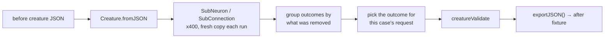

# Pruning parity matrix — TypeScript behaviour to Rust fixture (Issue #588)

The canonical pruning rewrite engine (Issue #587) moves NEAT-AI's removal
semantics out of TypeScript and into `neat-core`. Step 1 of that migration is
this matrix: every battle-tested TypeScript behaviour that a shared Rust helper
must reproduce, mapped to the fixture that captures it and the test that pins
it.

Nothing here prunes. The fixtures are the acceptance oracle the shared helpers
are graded against, and both now exist: `prune_neuron` (Issue #590) for the
`RemoveNeuron` captures and `prune_synapse` (Issue #591) for the
`RemoveSynapse` ones. **How each case is graded is per case** — byte equality
where this crate's canonical form coincides with the capture, activation
equality where the constant-support divergence below applies. The two
"How Issue #59x is graded" tables are the record; nothing here claims byte
parity across the board.

## Where the behaviour lives

| Side | Home |
|------|------|
| Fixtures | `neat-core/src/prune_fixtures.rs` — `PRUNE_PARITY_CASES` |
| Tests | `neat-core/tests/prune_parity.rs` |
| TypeScript source | NEAT-AI `src/mutate/`, `src/compact/`, `src/architecture/` |

Each `PruneCase` carries its own provenance as data — `ts_source`, `ts_test`,
`rule` — and that data is authoritative: the table below restates it for
readers, and `every_case_names_the_typescript_behaviour_it_captures` fails the
build if a capture arrives without it. Where the two disagree, the fixture
wins.

## The matrix

| Rust fixture | Behaviour captured | TypeScript source | TypeScript test | Rust test |
|---|---|---|---|---|
| `CASCADE_ORPHAN_FEEDERS` | removing a neuron removes every feeder the removal orphans, to a fixed point | `src/mutate/SubNeuron.ts`, `src/compact/OrphanedNeuronCleanup.ts` | `test/mutate/SubNeuronCascadeOrphan.ts` | `removing_a_neuron_cascades_through_every_orphaned_feeder` |
| `EDGE_TARGET_BECOMES_CONSTANT` | a hidden target with no inward edge left but an outward one becomes a constant, `bias = squash(bias)` | `src/mutate/SubConnection.ts` | `test/mutate/SubConnection.ts` | `a_target_that_loses_its_last_inward_edge_folds_its_squash_into_a_constant` |
| `EDGE_SOURCE_BECOMES_DEAD` | a hidden or constant source left with no outward edge is removed | `src/mutate/SubConnection.ts` | `test/mutate/SubConnectionStaleFromIndex.ts` | `a_source_left_with_nothing_to_feed_is_removed` |
| `EDGE_ROLE_IDENTITY` | only the requested `(from, to, role)` triple is removed, not every edge of the pair | `src/mutate/SubConnection.ts`, `src/architecture/SynapseKey.ts` | `test/creature/TypedSynapseKey.ts` | `removing_one_role_keeps_the_other_role_of_the_same_pair` |
| `IF_REPAIR_COALESCES_ROLES` | an `IF` missing a required role is downgraded to `IDENTITY`, roles stripped, coalesced rows summed | `src/architecture/RepairInvalidIfNeurons.ts`, `src/architecture/CoalesceInwardSynapses.ts` | `test/NEAT/MutatorForwardOnlyIFConditionsRepair.ts`, `test/fix/IfRoleAssignmentCoalesce.ts` | `an_if_that_loses_a_role_is_downgraded_and_its_rows_are_summed` |
| `CONSTANT_MOVES_INTO_PREFIX` | after a hidden→constant flip the slice is re-ordered constants-then-hiddens and the synapses re-sorted | `src/architecture/NormaliseComputationalNeuronOrder.ts` | `test/architecture/ForwardOnlyTopologyAfterBulkRemap.ts`, `test/validate/CreatureValidate.ts` | `a_converted_constant_moves_ahead_of_the_hidden_neurons` |
| `MEMETIC_DROPPED_ON_REMOVAL` | a successful removal drops the content-derived identity — of which a `CreatureExport` represents only `memetic` | `src/compact/OrphanedNeuronCleanup.ts`, `src/mutate/SubNeuron.ts` | `test/architecture/StaleUuidAfterStructuralChange.ts` | `a_memetic_record_naming_removed_structure_is_dropped_whole` |
| `CONSTANT_BIAS_FOLD` | compensation folds `w · meanActivation` of the removed neuron into each target's bias | `src/architecture/ErrorGuidedStructuralEvolution/DiscoveryNeuronRemoval.ts` | `test/ErrorGuidedStructuralEvolution/DiscoveryOperationIntegrity.ts` | `the_constant_bias_fold_leaves_the_creature_scoring_identically` |

Four rules hold across **every** case rather than belonging to one, and are
asserted over the whole slice:

| Rule | Rust test |
|---|---|
| a successful rewrite never returns an invalid creature | `every_captured_pair_is_a_creature_the_shared_validator_accepts` |
| no orphan survives — hidden neurons keep both directions, constants keep an outward edge and take none inward | `no_orphan_neuron_survives_a_rewrite` |
| stable canonical ordering after a topology change — constants, then hiddens, then outputs; synapses sorted by `(from, to, role)` | `the_computational_slice_stays_constants_then_hiddens_then_outputs`, `synapses_come_back_in_canonical_from_to_role_order` |
| the content-derived identity is invalidated | `a_rewrite_sheds_the_content_derived_memetic_record` |

## How the fixtures were captured

The `after` half of every pair is TypeScript's own output, not a hand-derived
guess. Each `before` creature was loaded with `Creature.fromJSON`, the real
mutation operator (`SubNeuron` or `SubConnection`) was run several hundred
times from a fresh copy, and the distinct outcomes were grouped by which
neuron or synapse the operator happened to pick — the operators choose at
random, so enumerating outcomes is what makes one reproducible. The outcome
matching the case's `request` is recorded as `after`. The JSON was transcribed
from `exportJSON()` — re-indented, and given the `forwardOnly` flag this crate
always writes — with every neuron, synapse, weight, bias, role and their order
unchanged. Both halves were `creatureValidate`d TypeScript-side before being
written down. Captured against NEAT-AI `7.0.25`.

The harness is reproduced here so the captures can be re-derived when the
TypeScript changes. Save it inside a NEAT-AI checkout (the import aliases are
that repo's) and run `deno run -A capture.ts`:

```ts
import { Creature } from "@creature";
import { SubNeuron } from "@mutate/SubNeuron.ts";
import { SubConnection } from "@mutate/SubConnection.ts";
import { creatureValidate } from "@architecture/CreatureValidate.ts";

/** Identity of one outcome: which neurons and synapses came back. */
function key(exp: any): string {
  const ns = exp.neurons
    .map((n: any) => `${n.type}:${n.uuid}:${n.bias}:${n.squash ?? "-"}`)
    .join("|");
  const ss = exp.synapses
    .map((s: any) => `${s.fromUUID}->${s.toUUID}:${s.type ?? "-"}:${s.weight}`)
    .join("|");
  return `${ns}###${ss}`;
}

/** Run one operator repeatedly and print each distinct outcome once. */
export function capture(
  name: string,
  json: unknown,
  op: "SubNeuron" | "SubConnection",
  attempts = 400,
): void {
  const seen = new Map<string, unknown>();
  for (let i = 0; i < attempts; i++) {
    const creature = Creature.fromJSON(structuredClone(json));
    const mutator = op === "SubNeuron"
      ? new SubNeuron(creature)
      : new SubConnection(creature);
    if (!mutator.mutate()) continue;
    creatureValidate(creature);          // fail loud on an invalid rewrite
    const exp = creature.exportJSON();
    seen.set(key(exp), exp);
  }
  console.log(`##### ${name} (${op}) — ${seen.size} distinct outcomes`);
  for (const exp of seen.values()) console.log(JSON.stringify(exp));
}
```

The `before` half of each fixture is the input JSON round-tripped through
`Creature.fromJSON(...).exportJSON()`, which is what puts it in canonical
order; the `after` half is the printed outcome whose removed neuron or synapse
matches the case's `request`.



## What the tests can and cannot prove today

The oracle is the TypeScript output plus the documented rules that output
obeys — never a second copy of a pruning implementation, which would move both
sides of the assertion together. Two case-specific oracles are independent
derivations rather than fixture restatements:

- the hidden→constant fold is checked against the **documented logistic**
  computed in `f64` in the test, and cross-checked against this crate's own
  `apply_squash` at `f32` precision;
- the constant bias fold is checked by **activating both halves** through
  `compile_creature` and asserting the outputs agree — a constant carries no
  per-sample variance, so that fold is exact and the pruned creature must score
  identically.

Every fixture was mutation-checked one at a time (an orphan left behind, an
unfolded bias, a role removed with its partner, roles left uncoalesced, a
constant left after a hidden, a short fold, a surviving memetic record,
out-of-order synapses); each mutation turned the suite red, so no captured rule
is pinned by a test that cannot fail.

## Where the Rust canonical form diverges (Issue #589)

`cleanup_creature` (Issue #589) reproduces the cascade and `IF`-repair captures
byte for byte, but **not** the two that carry a folded constant. TypeScript
writes the folded value into the constant's `bias`; the Rust canonical form
holds the constant support invariants instead (Ockham #180) — every constant is
a bias-`1` support node, folds reuse an existing one, and a creature carries at
most three. The value moves into the **weights** of the edges that read the
constant, which is the same function of the inputs.

So for those cases the fixture stays the oracle, on the property that matters:
`neat-core/tests/prune_cleanup.rs` compiles and activates both the capture and
the cleaned creature and asserts the outputs agree, rather than comparing their
bytes.

| Case | Graded by |
|---|---|
| `CASCADE_ORPHAN_FEEDERS`, `IF_REPAIR_COALESCES_ROLES` | structural equality with the capture |
| `EDGE_TARGET_BECOMES_CONSTANT`, `CONSTANT_MOVES_INTO_PREFIX` | activation equality with the capture |

## How Issue #590 is graded against the captures

`prune_neuron` (Issue #590) is the first helper the `RemoveNeuron` captures can
be run against end to end. `neat-core/tests/prune_neuron.rs` grades it:

| Case | Graded by |
|---|---|
| `CASCADE_ORPHAN_FEEDERS` | structural equality with the capture — `prune_neuron(before, "h-x")` **is** `after` |
| `IF_REPAIR_COALESCES_ROLES` | structural equality with the capture |
| `MEMETIC_DROPPED_ON_REMOVAL` | structural equality on the neurons and synapses; the record is **pruned**, not dropped (the divergence above) |
| `CONSTANT_BIAS_FOLD` | its request removes a *constant*, which `prune_neuron` protects, so the fold is graded on the hidden-neuron twin: an `IDENTITY` neuron that sums nothing is worth `0.5` on every record just as that constant is, on the same weight into the same target, and produces the capture's `after` |

## How Issue #591 is graded against the captures

`prune_synapse` (Issue #591) is the helper the `RemoveSynapse` captures grade,
in `neat-core/tests/prune_synapse.rs`:

| Case | Graded by |
|---|---|
| `EDGE_ROLE_IDENTITY` | structural equality with the capture — only the requested `(from, to, role)` triple goes |
| `EDGE_SOURCE_BECOMES_DEAD` | structural equality with the capture |
| `EDGE_TARGET_BECOMES_CONSTANT`, `CONSTANT_MOVES_INTO_PREFIX` | activation equality with the capture — the constant-support divergence above |
| `CASCADE_ORPHAN_FEEDERS` | structural equality, driven from the synapse side: removing `h-x -> output-0` orphans the same five neurons the neuron removal does |

The `IF` rewrites have no capture to grade against, because TypeScript refuses
the requests that reach them. Their oracle is a **zero-weight twin** built in
the test: the original creature with the removed edge's weight set to `0` is the
same function of the inputs as the original without that edge, and it is reached
without touching the code under test. Both creatures are compiled and activated,
and the rewrite has to agree on every probe.

## Not captured here

- **Selection policy.** Which neuron or synapse to try is the caller's, per the
  Issue #587 ownership boundary; the fixtures record the request, not how it
  was chosen.
- **Variance-aware compensation.** `DiscoveryNeuronRemoval.ts` also bumps a
  correlated survivor's weight (`removeNeuronCompensation`). That remedy needs
  Discovery-side statistics no `CreatureExport` carries, so it is not a
  structural fixture — it is **supplied data**, and Issue #590 landed it as
  `PruneStats::proxy`: `β = cov / σₛ²` onto the survivor's existing edge, the
  rest of the mean into the target's bias. `neat-core/tests/prune_neuron.rs`
  derives both from the formula rather than from a capture.
- **The `uuid` half of the identity rule.** TypeScript sheds `creature.uuid`
  alongside `memetic` on every removal, but a `CreatureExport` carries no
  creature-level `uuid` field, so there is nothing for a fixture to assert —
  the issue's "where represented in core" hedge is doing real work here.
- **The refusal path — deliberately not reproduced.**
  `SubConnection.ts::#wouldBreakIfNeuron` declines to remove an edge that would
  leave an `IF` short a role, so a whole class of typed structure is unreachable
  to the TypeScript mutation operators. Issue #591 **improves on it** rather
  than porting it: `prune_synapse` rewrites the `IF` exactly instead of refusing
  the request (see the section above), so there is no refusal for a fixture to
  capture. `RepairInvalidIfNeurons.ts`'s `indx <= 2` skip is likewise not
  reproduced — cleanup is gated on the structural leg, which has no such
  exemption.
- **Memetic pruning.** TypeScript drops the record wholesale; this crate
  already owns the finer-grained inverse of validation rule 31
  (see README, "Pruning — rule 31's inverse"). The fixture captures the
  TypeScript behaviour; Issue #590 **decided for the prune**: `prune_neuron`
  keeps every entry that still names live structure and drops exactly the
  dangling ones, because the fine-tuning history a caller measured is worth more
  than a blunt reset and rule 31 is satisfied either way.
