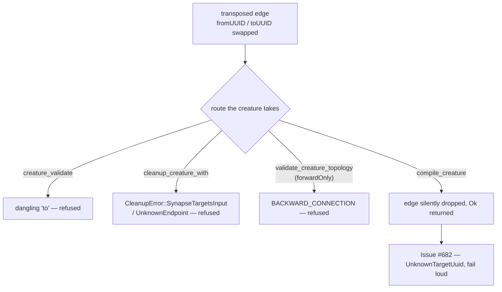

# UUID endpoints stay `String` — decision record (Issue #672)

**Decision: KEEP `String`.** `from_uuid` / `to_uuid` / `uuid` remain plain
`String` on `SynapseExport` and on the eleven other public items that carry the
pair. A transparent `NeuronUuid(String)` newtype is **declined**: by the
proposing issue's own analysis it prevents no transposition, the only variant
that would prevent one (distinct `SourceUuid` / `TargetUuid`) is unworkable in
a graph, and either shape is a breaking change to twelve public items across
five of the six registered downstream consumers.

The risk the issue is really pointing at — a transposed edge reaching a
compiled network unnoticed — is real, and it is **not** a typing problem. It is
tracked and fixed as [#682](https://github.com/stSoftwareAU/NEAT-AI-core/issues/682).

## What was proposed

Introduce `NeuronUuid(String)` with `#[serde(transparent)]` so the JSON wire
shape is byte-identical, and use it for `uuid`, `from_uuid` and `to_uuid`, so
that a caller writing `SynapseExport { from_uuid: b, to_uuid: a, .. }` for
`{ from_uuid: a, to_uuid: b }` would be caught by the compiler rather than by
downstream validation.

## Why it is declined

### 1. One newtype for both endpoints catches nothing

Both fields would hold the same type, so the transposed literal still
type-checks and still compiles. Issue #672 says so itself: the transposition
becomes a type mismatch "only if the two ever diverge into distinct newtypes".
The proposal as written buys the churn without the property it is bought for.

### 2. Distinct `SourceUuid` / `TargetUuid` are unworkable in a graph

The property only arrives with two *different* types — and in a network every
target UUID is some other edge's source UUID. In the two-synapse creature
`input-0 → h-1 → out-0`, `h-1` is the `toUUID` of the first edge and the
`fromUUID` of the second: it is one neuron, and the types would have to
disagree about it.

Both resolution sites read the two endpoints against **one** table for exactly
that reason:

- `compile_creature` resolves sources through `uuid_to_index` and groups
  destinations by the same key space (`neat-core/src/creature.rs:860`,
  `:895-902`);
- `creature_validate` resolves both ends through one `resolve`
  (`neat-core/src/creature_validate.rs:1238`).

Distinct newtypes would need a `SourceUuid ↔ TargetUuid` conversion at every
such site. The transposition risk does not disappear; it moves into the
conversion, one level down and less visible than the named struct field it
replaced.

### 3. The pair is twelve public items, not one

`SynapseExport` is the smallest part of the surface. The same `from_uuid` /
`to_uuid` pair is public on:

| Item | Location |
|------|----------|
|`creature::SynapseExport`|`creature.rs:159`|
|`creature::MemeticWeightRowExport` (both `Option<String>`)|`creature.rs:331`|
|`creature::CreatureError::DuplicateSynapse`|`creature.rs:421`|
|`creature::CreatureError::TypedDuplicateSynapse`|`creature.rs:436`|
|`prune_json::SynapseKeyJson`|`prune_json.rs:187`|
|`prune_json::WeightShareJson`|`prune_json.rs:285`|
|`prune_cleanup::SynapseKey`|`prune_cleanup.rs:146`|
|`prune_cleanup::CleanupError::NonFiniteWeight`|`prune_cleanup.rs:284`|
|`prune_cleanup::CleanupError::InexactMerge`|`prune_cleanup.rs:295`|
|`prune_neuron::WeightShare`|`prune_neuron.rs:218`|
|`prune_neuron::PruneError::UnknownSynapse`|`prune_neuron.rs:335`|
|`prune_neuron::PruneError::MissingProxyEdge`|`prune_neuron.rs:399`|

A newtype adopted on `SynapseExport` alone would make the crate *less*
coherent, not more: the wire struct and the errors describing it would
disagree about what a UUID is.

### 4. It is a breaking change across five registered consumers

[`RELEASING.md`](../../RELEASING.md#what-counts-as-breaking) lists "narrowing
or changing a public type, **including struct field types**" as breaking, so
this is the three-phase flow — add the alternative, migrate every registered
consumer, remove the old surface — over twelve items. A `gh` code search across
[`scripts/downstream-consumers.txt`](../../scripts/downstream-consumers.txt)
found files referencing `from_uuid` / `to_uuid` in five of the six registered
repositories (NEAT-AI-scorer 7, NEAT-AI-Backpropagation 8, NEAT-AI-Rebase 6,
NEAT-AI-Forests 3, NEAT-AI-Ockham 23; NEAT-AI-Lamarck not sampled — the search
API rate-limited). Paying that across seven repositories for property (1),
which is no property at all, is not a trade this crate should make.

### 5. The `if_graft.rs` half of the finding does not hold

Issue #672 also cites `GraftEdge::new` / `with_role` (`if_graft.rs:119-133`) as
the same shape. It is not: `GraftEdge` carries a **single** `uuid` — "the
neuron at the other end of the edge" (`if_graft.rs:101`) — and the direction
comes from which list the edge is placed in (`condition` / `positive` /
`negative` are inbound, `targets` outbound). There is no endpoint pair to
transpose, so there is nothing there for a newtype to protect.

## What the risk actually is, and where it is fixed

Issue #672 states that "the only backstop against a transposed edge is
downstream validation". That understates it in one direction and overstates it
in another.

A transposed edge between two **listed** neurons is caught: it is a backward
edge, which `validate_topology_typed` reports as `BACKWARD_CONNECTION`
(`topology_ops.rs:188`) for a `forwardOnly` creature, and
`validate_no_duplicate_synapses` guards the repeat cases. A transposition
pointing at an **input** neuron is caught by `creature_validate`
(`creature_validate.rs:1238`) and by `cleanup_creature_with`
(`CleanupError::SynapseTargetsInput`, `prune_cleanup.rs:269`).

But `compile_creature` — the function that turns a creature into the network
the fleet scores — catches neither. It groups synapses by `to_uuid` and reads
them back per listed neuron, so an edge whose destination is not a listed
neuron is never looked up and is **silently dropped**, and the call still
returns `Ok`. Its mirror case, an unresolvable source, is
`CreatureError::UnknownSourceUuid`.

That asymmetry is the defect worth fixing, and no newtype would have found it:
a transposed edge is transposed between two values of the *same* kind. It is
[#682](https://github.com/stSoftwareAU/NEAT-AI-core/issues/682), a fail-loud
`CreatureError::UnknownTargetUuid` on the compile path, sized as the breaking
change it is.

