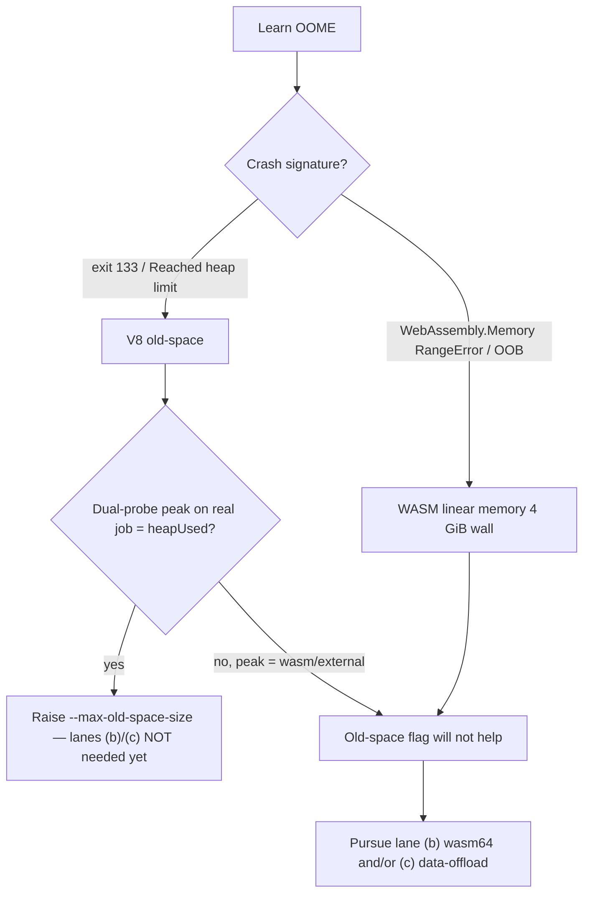

# wasm64 lane (a): where the ~4 GB ceiling binds — V8 heap vs WASM linear memory

Gating diagnostic for milestone #295 (Issue #296). This lane decides whether the
wasm64 build lane (b, #297) and the data-offload lane (c, #298) are needed at
all. Method-first per the performance workflow (#177/#1428): measure, don't
guess.

## Question

Production learn jobs were scaled down to fit a ~4 GB ceiling even though the
production hosts have far more RAM (the motivating failure: `Learn.ts` exit 133
OOME at ~4.2 GB). Before committing to a wasm64 build or a data-offload
architecture we must prove
**which pool binds**: the V8 JS heap (old-space) or WASM linear memory.

## The two ceilings are distinguishable by signature

A Deno learn process spends memory across three distinct pools, each with its
own ceiling and its own crash signature:

| Pool | What lives there | Ceiling | Crash signature | Lifted by `--max-old-space-size`? |
| --- | --- | --- | --- | --- |
| V8 old-space (JS heap) | plain JS objects, arrays of boxed numbers, object graphs | `--max-old-space-size` (default ~2–4 GB) | `Fatal JavaScript out of memory: Reached heap limit`, **exit 133** | **Yes** |
| External buffers | `ArrayBuffer` / `TypedArray` backing stores | host RAM / RSS | allocation error or OS OOM kill | No |
| WASM linear memory | data owned by the `wasm_activation` module | **hard 4 GiB on wasm32** (65536 pages × 64 KiB) | `RangeError: WebAssembly.Memory.grow(): Maximum memory size exceeded` / `RuntimeError: memory access out of bounds` | **No** |

The exit-133 `Reached heap limit` abort and the `WebAssembly.Memory` RangeError
are unambiguous in the log text — that is what makes the attribution decidable.

## Evidence (captured locally, Deno 2.9.0 / V8 14.9, 24 GB host)

Reproduced with the committed harness
[`tests/perf/learn_oome_repro.ts`](../../tests/perf/learn_oome_repro.ts) and its
tests. Both probes — `Deno.memoryUsage()` **and**
`WebAssembly.Memory.buffer.byteLength` — are captured together, because
NEAT-AI#3410 shows a single-probe MemoryMonitor misreads the limit.

### V8 old-space (JS heap) — matches the production failure

`heap` mode grows retained plain-JS objects until the process aborts:

```text
$ LEARN_OOME_REPRO=1 deno run --allow-env \
    --v8-flags=--max-old-space-size=256 tests/perf/learn_oome_repro.ts heap 2000

<--- Last few GCs --->
[..] Mark-Compact 255.9 (260.5) -> 255.9 (260.5) MB [..] last resort; GC in old space requested
#
# Fatal JavaScript out of memory: Reached heap limit
#
exit=133
```

This is the **exact production-failure signature**: exit 133, `Reached heap
limit`. It is
a V8 old-space abort.

Raising the cap lets the *identical* job complete:

```text
$ LEARN_OOME_REPRO=1 deno run --allow-env \
    --v8-flags=--max-old-space-size=3072 tests/perf/learn_oome_repro.ts heap 2000
[learn] PEAK(heap): rss=2138MiB heapUsed=2050MiB heapTotal=2084MiB external=1MiB wasm=0MiB -> attributed=v8-heap
[learn] OK: heap job reached 2000 MiB old-space
exit=0
```

**Answer to the `--max-old-space-size` question: yes** — a 2000 MiB old-space
job that aborts (exit 133) at `--max-old-space-size=256` completes cleanly at
`--max-old-space-size=3072`, at negligible wall-clock cost (sub-second here; the
flag changes the GC limit, not the work done).

### WASM linear memory (wasm32) — a hard 4 GiB wall

`wasm` mode grows a `WebAssembly.Memory` towards a >4 GiB target:

```text
$ LEARN_OOME_REPRO=1 deno run --allow-env tests/perf/learn_oome_repro.ts wasm 6
[learn] PEAK(wasm): rss=40MiB heapUsed=2MiB heapTotal=4MiB external=1MiB wasm=4032MiB -> attributed=wasm-linear-memory
[learn] FAIL: wasm-linear-memory | peakPages=64513 peakBytes=4227923968 (3.938 GiB) | RangeError: WebAssembly.Memory.grow(): Maximum memory size exceeded
```

Constructing a Memory larger than 4 GiB fails at the boundary:

```text
RangeError: WebAssembly.Memory(): Property 'initial': value 65537 is above the upper bound 65536
```

This ceiling is **architectural and RAM-independent**: 65536 pages × 64 KiB =
exactly 4 GiB is the entire wasm32 address space. Adding host RAM or raising
`--max-old-space-size` cannot move it. The production `wasm_activation` bundle is
built `wasm-pack build neat-core --target web`
([`scripts/build-wasm-bundle.sh`](../../scripts/build-wasm-bundle.sh)) — a
**wasm32** module with no `memory64` feature — so any data the module holds is
subject to this 4 GiB wall.

## Silent-failure risk found: exit 133 is a native abort with no marker

A V8 old-space OOM is a **native process abort**, not a catchable JS exception —
the crashing child cannot print its own `[learn] FAIL:` marker. The downstream
production launcher downgrades a marker-less non-zero exit to success (the
silent-failure downgrade behaviour), so an exit-133
learn crash would be **silently reported green**. The harness closes this at the
launcher: `markerForExit()` / the `guard` mode subprocess the learn child and
synthesise the marker on exit 133:

```text
$ LEARN_OOME_REPRO=1 deno run --allow-env --allow-run \
    tests/perf/learn_oome_repro.ts guard 2000 256
[learn] FAIL: v8-heap | child exited 133 (Reached heap limit) with no marker
```

Lane (d) (downstream wiring, #299) must adopt this launcher-side rule: **treat exit 133
as a hard failure regardless of marker**.

## Attribution and recommendation



- **The currently observed production ceiling is the V8 JS heap.** The
  production failure's captured signature is exit 133 / `Reached heap limit` — the V8 old-space
  abort, reproduced here byte-for-byte. It is **not** a `WebAssembly.Memory`
  RangeError or an out-of-bounds trap, so WASM linear memory is not what is
  binding today.
- **The cheap fix is the correct first move.** Raising
  `--v8-flags=--max-old-space-size=<N>` demonstrably lets a previously-OOMing
  old-space job complete, and the production hosts have the RAM for it.
- **Do not pursue lanes (b)/(c) yet, but do not close them.** On current
  evidence the wasm64 build (b) and data-offload (c) are not required to clear
  the production failure. They become necessary if, and only if, either:
  1. the dual-probe on the **real** Learn.ts job attributes the peak to WASM
     linear memory or external buffers (not `heapUsed`); or
  2. raising old-space merely walks the job toward the wasm32 4 GiB wall as the
     training set grows — at which point only a wasm64 (Memory64) build lifts it.

### What remains — owned by lane (d) (#299)

Acceptance step 3 (re-run the *actual* failing production job on an 8 GB
production host under the raised flag) requires the downstream learn invocation and an 8 GB host,
which lane (d) (#299) owns end-to-end. Lane (d) should run the real job with the
dual probe from this harness and confirm the peak is `heapUsed`-dominated before
the "heap cap suffices" conclusion is locked in and #295 is closed. If that
production dual-probe instead attributes the peak to WASM linear memory, this
finding's conclusion is wrong and lanes (b)/(c) proceed — that is the failure
signal to watch (per this issue's Failure Detection).

## Reproducing

```text
# V8 heap ceiling (exit 133) and the raised-cap completion:
LEARN_OOME_REPRO=1 deno run --allow-env \
  --v8-flags=--max-old-space-size=256  tests/perf/learn_oome_repro.ts heap 2000
LEARN_OOME_REPRO=1 deno run --allow-env \
  --v8-flags=--max-old-space-size=3072 tests/perf/learn_oome_repro.ts heap 2000

# WASM linear-memory 4 GiB wall:
LEARN_OOME_REPRO=1 deno run --allow-env tests/perf/learn_oome_repro.ts wasm 6

# Launcher marker synthesis for the native exit-133 abort:
LEARN_OOME_REPRO=1 deno run --allow-env --allow-run \
  tests/perf/learn_oome_repro.ts guard 2000 256

# Unit tests for the classifier / probe / attribution functions:
deno test --allow-env tests/perf/learn_oome_repro_test.ts
```

The harness is gated behind `LEARN_OOME_REPRO=1` so it never runs in default CI —
only on an 8 GB+ host.
