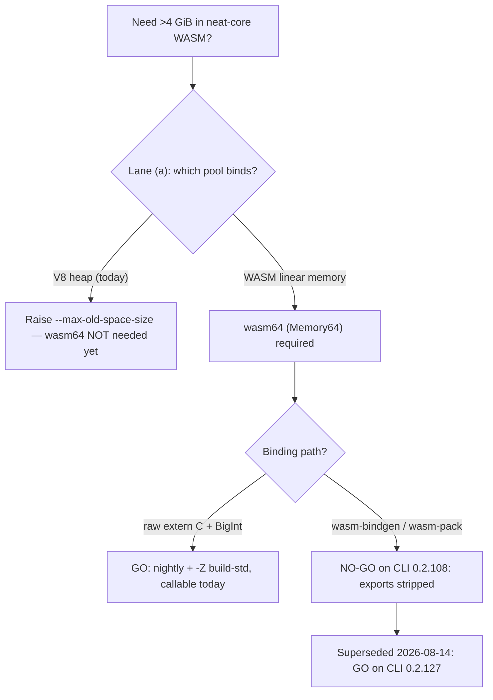
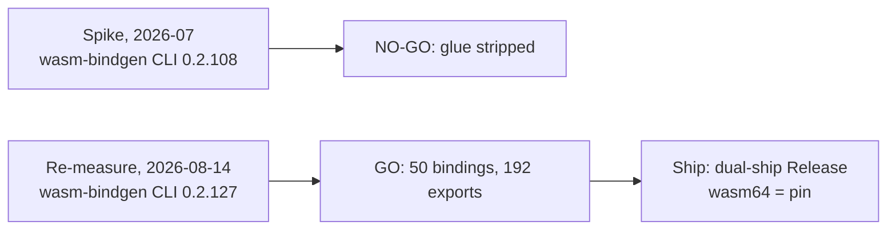

# wasm64 lane (b): build-lane feasibility spike (Rust Tier 3 + Deno/V8 Memory64)

Feasibility spike for milestone #295 (Issue #297). Follows lane (a)
([`wasm64-lane-a-4gb-ceiling-attribution.md`](wasm64-lane-a-4gb-ceiling-attribution.md)),
which found the ~4 GB learn-job ceiling currently binds on the **V8 JS heap**,
not WASM linear memory — so lanes (b)/(c) are **not needed yet, but not closed**.
This lane answers the gating engineering question for lane (b): *if* a wasm64
(Memory64) build becomes necessary, **can it actually be built and loaded in
Deno 2.9.3 today?** Method-first per the performance workflow (#177/#1428):
measure, don't guess.

> **Superseded in part — re-measured 2026-08-14 (Issue #541).** The production
> `wasm-bindgen` NO-GO recorded below was **CLI skew, not a permanent gap**. See
> [Re-measurement, 2026-08-14](#re-measurement-2026-08-14-issue-541) at the foot
> of this document: with CLI **0.2.127** the production path emits the full
> activation/backprop surface, and `neat-core` now **ships** a Memory64 bundle.
> Everything else here — the Tier 3 build requirements, the runtime findings,
> and lane (a)'s V8-heap attribution — still stands.

## Go / no-go finding

**Qualified GO.** A working wasm64 (Memory64) neat-core artefact **is** buildable
and loadable in Deno 2.9.3 today — but **only** via the raw `extern "C"` +
hand-rolled `BigInt` bindings path on a Rust **nightly** toolchain with
`-Z build-std`. The production binding path this repo actually ships
(`wasm-bindgen` / `wasm-pack`, see
[`scripts/build-wasm-bundle.sh`](../../scripts/build-wasm-bundle.sh)) was a
**NO-GO** *at the CLI version measured here* (0.2.108): the `wasm-bindgen` CLI
silently strips the exported bindings from a Memory64 module. **That row is
superseded** — see the 2026-08-14 re-measurement.

| Spike axis | Verdict | Evidence (this host) |
| --- | --- | --- |
| **Runtime** — Deno 2.9.3 / V8 14.9 instantiates Memory64 & grows past 4 GiB | **GO** | grows to the V8 impl limit of **262144 pages = 16 GiB**; committed smoke test |
| **Build (raw)** — `cargo build --target wasm64-unknown-unknown -Z build-std` | **GO (nightly only)** | produces a genuine `(memory i64 …)` module exporting `accumulate` |
| **Bindings (raw)** — 64-bit (`BigInt`) pointers across JS↔WASM | **GO** | `accumulate(BigInt ptr, BigInt len)` returns the correct sum |
| **Build (production)** — `wasm-bindgen` / `wasm-pack` on wasm64 | ~~**NO-GO**~~ → **GO on CLI ≥ 0.2.120** | CLI **0.2.108** exits 0 but strips `accumulate` + `__wbindgen_malloc`; CLI **0.2.127** does not (2026-08-14) |
| **Perf** — wasm64 vs wasm32 on a 4 GiB-fitting job | **no measurable regression** | scalar accumulate within **±2 %** (measurement noise) |

## Exact toolchain versions (reproduction baseline)

| Tool | Version |
| --- | --- |
| Deno | `2.9.3 (stable, release, aarch64-apple-darwin)` |
| V8 | `14.9.207.2-rusty` |
| rustc (build) | `1.99.0-nightly (9f36de775 2026-07-19)` + `rust-src` |
| rustc (stable) | `1.97.1 (8bab26f4f 2026-07-14)` |
| wasm-pack | `0.13.1` |
| wasm-bindgen CLI | `0.2.108` |
| wasm-bindgen crate | `0.2.126` (repo default; skew noted below) |

## 1. Runtime support — GO (committed as a smoke test)

Deno 2.9.3's V8 **does** support Wasm 3.0 Memory64. A minimal hand-assembled
`(memory i64 …)` module validates, instantiates, and grows linear memory well
past the wasm32 4 GiB wall:

- `WebAssembly.validate` accepts the i64 memory-type flag (`0x04`).
- `WebAssembly.Memory.grow()` on an i64 memory **requires and returns a
  `BigInt`** — a `Number` delta throws `TypeError: Cannot convert … to a
  BigInt`. This is the observable signature of the 64-bit index type.
- Growth succeeds up to the **V8 implementation limit of 262144 pages = 16 GiB**
  (a declared maximum above that fails at compile with
  `maximum memory size (… pages) is larger than implementation limit (262144
  pages)`).
- Pages are reserved lazily: growing past 4 GiB reserves address space without
  committing physical RAM — the smoke test touches only a handful of pages, so
  peak RSS stays ~34 MiB. This is what makes it safe to run in default CI.

This is captured as the committed
[`tests/wasm64_memory64_smoke_test.ts`](../../tests/wasm64_memory64_smoke_test.ts)
(+ helpers in
[`tests/wasm64_memory64_smoke.ts`](../../tests/wasm64_memory64_smoke.ts)). It
instantiates the minimal module, grows past 4 GiB, and round-trips a `BigInt`
offset above 4 GiB through the module's exported `store`/`load` functions. It is
wired into a new `wasm64-memory64-smoke` CI job (`.github/workflows/ci.yml`) so a
Deno/V8 upgrade that drops or breaks Memory64 fails **in CI**, not mid-port.

## 2. Build toolchain — GO on nightly, breakages documented

`wasm64-unknown-unknown` is a **Rust Tier 3** target: `rustc` knows it
(`rustc --print target-list` lists it) but there are **no prebuilt `std`
artefacts**.

- **Stable is a NO-GO.** `rustup target add wasm64-unknown-unknown` refuses
  (`has no prebuilt artifacts available for target 'wasm64-unknown-unknown'`),
  and a stable build fails with `error[E0463]: can't find crate for std … build
  the standard library from source with -Zbuild-std`.
- **Nightly + `build-std` is a GO.** With `nightly-2026-07-19` and the
  `rust-src` component, a trivial neat-core-style kernel builds cleanly:

  ```text
  cargo +nightly build --target wasm64-unknown-unknown --release \
    -Z build-std=std,panic_abort
  ```

  The output `.wasm` is a genuine Memory64 module — its memory section carries
  flags `0x04` (i64 index) and it exports `accumulate` + `memory`.

### `Cargo.toml` gap: the wasm cfg is keyed to `wasm32`

`neat-core/Cargo.toml` gates its wasm deps on `cfg(target_arch = "wasm32")`:

```toml
[target.'cfg(target_arch = "wasm32")'.dependencies]
wasm-bindgen = "0.2.126"
```

For a `wasm64-unknown-unknown` build `target_arch` is `"wasm64"`, so this table
would **not** apply — a real port must widen the cfg to
`cfg(target_family = "wasm")` (and re-audit the `rayon`
`cfg(not(target_arch = "wasm32"))` exclusion, which would wrongly pull `rayon`
into a wasm64 build). No change is made in this spike; it is recorded for the
planning stage.

## 3. Bindings — GO for raw `extern "C"`, NO-GO for wasm-bindgen

**Raw path works.** Instantiated from Deno, the raw kernel is callable across the
boundary with 64-bit pointers passed as `BigInt`:

```text
accumulate(BigInt(1024), 4n) = 7.25   // 4 f32 written at byte offset 1024
```

**wasm-bindgen / wasm-pack silently drop exports on wasm64.** The crate
*compiles* for wasm64, but the CLI post-processing step is broken. With the CLI
and crate versions aligned to `0.2.108`, the **same crate** yields:

| Target | `accumulate` in generated glue? | `accumulate` in `_bg.wasm` exports? |
| --- | --- | --- |
| `wasm32-unknown-unknown` | **yes** (`export function accumulate(xs)`) | yes (+ `__wbindgen_malloc`) |
| `wasm64-unknown-unknown` | **no** — glue has only `initSync`/`init` | **no** — `accumulate` + `__wbindgen_malloc` stripped |

Critically, `wasm-bindgen … --target web` **exits 0** while producing a package
with no working bindings — a **silent failure** (cf. the repo's "never fail
silently" principle). Any future wasm64 adoption via `wasm-pack` must treat this
as a hard blocker and pin/verify a `wasm-bindgen` release that documents wasm64
support, or fall back to the raw `extern "C"` + `BigInt` binding path.

> The observed CLI/crate skew (installed CLI `0.2.108` vs repo default crate
> `0.2.126`) is a separate, ordinary version-match issue and is **not** the
> wasm64 breakage — the table above was produced with both pinned to `0.2.108`.

## 4. Performance — no measurable regression on 4 GiB-fitting jobs

Per the parent decision, headroom is prioritised over throughput, but a
regression on jobs that fit 4 GB must be **recorded, not hidden**. A full #286
Criterion comparison of the real neat-core wasm bundle is **blocked** by the
wasm-bindgen no-go above (the production bundle cannot be built for wasm64). As a
proportionate substitute, the identical raw `extern "C"` accumulate kernel was
built for both targets and timed in Deno over a 4 MiB (1 M × f32) buffer that
fits comfortably under 4 GiB:

| Target | µs / call (500 iters × 1 M f32) |
| --- | --- |
| wasm32 | ~515–525 µs |
| wasm64 | ~515–525 µs |

Across repeated runs the wasm64/wasm32 ratio stays within **±2 %** — within
measurement noise, i.e. **no measurable regression** for a scalar accumulate on
4 GiB-fitting work. (This is a micro-benchmark, not the #286 Criterion baseline;
a full comparison must wait until the production bundle is buildable for wasm64.)

## Recommendation (feeds #295 planning)



- **Do not adopt wasm64 yet** — consistent with lane (a): the current production
  ceiling is the V8 heap, liftable with `--max-old-space-size`. wasm64 becomes
  necessary only if the real Learn.ts job attributes its peak to WASM linear
  memory (lane (d), #299).
- **When/if wasm64 is adopted**, the viable path *at the CLI version measured
  here* is **raw `extern "C"` exports with hand-rolled `BigInt` bindings** on
  nightly + `-Z build-std`, not `wasm-pack`. A wasm-bindgen-based port is
  blocked until the toolchain ships working wasm64 post-processing. **Resolved
  2026-08-14:** it does, from CLI 0.2.120, and the shipped bundle takes the
  wasm-bindgen path — the raw fallback was not needed.
- **The runtime side is proven and guarded.** The committed smoke test locks in
  the Memory64 runtime capability so a future regression is caught in CI.

## Reproducing

```text
# Runtime (Memory64) smoke test — runs in default CI, ~34 MiB RSS:
deno test tests/wasm64_memory64_smoke_test.ts

# Build the raw kernel for wasm64 (nightly + rust-src required):
rustup toolchain install nightly --profile minimal --component rust-src
cargo +nightly build --target wasm64-unknown-unknown --release \
  -Z build-std=std,panic_abort
#   -> target/wasm64-unknown-unknown/release/<crate>.wasm  (memory flags 0x04 = i64)

# Confirm the production binding path is a no-go (wasm-bindgen strips exports):
wasm-bindgen <wasm64 .wasm> --target web --out-dir pkg64   # exits 0, no accumulate binding
```

The wasm64 build requires a network-fetched nightly toolchain + `rust-src`, so
it was **not** wired into default CI as a build step at the time of this spike
(unlike the runtime smoke test). It is now — see below.

## Re-measurement, 2026-08-14 (Issue #541)

**The production `wasm-bindgen` NO-GO above does not hold.** It was **CLI skew**:
`wasm-bindgen` **0.2.120** added `wasm64-unknown-unknown` / Memory64 codegen
([wasm-bindgen#5004](https://github.com/wasm-bindgen/wasm-bindgen/pull/5004)),
and the spike measured **0.2.108**. Re-run on the *whole* `neat-core` crate — not
a trivial kernel — with the CLI pinned to the crate version this repo depends on.

### Toolchain (this measurement)

| Tool | Version |
| --- | --- |
| Deno | `2.9.5 (stable, release, aarch64-apple-darwin)` |
| V8 | `15.0.245.2-rusty` |
| rustc (build) | `1.95.0-nightly (6efa357bf 2026-02-08)` + `rust-src` |
| rustc (stable) | `1.97.1 (8bab26f4f 2026-07-14)` |
| wasm-pack | `0.15.0` |
| wasm-bindgen CLI | `0.2.127` |
| wasm-bindgen crate | `0.2.127` (Cargo.lock; CLI pinned to match) |

### Findings

| Axis | Verdict | Evidence |
| --- | --- | --- |
| **Crate builds for wasm64** | **GO** | `cargo +nightly build -p neat-core --release --target wasm64-unknown-unknown -Z build-std=std,panic_abort` — clean, once the `cfg` gates were widened to `target_family = "wasm"` |
| **wasm-bindgen on the real crate** | **GO** | 68 KB glue, **50** `export`ed bindings, **192** module exports; `memory[0] pages: initial=17 i64` survives post-processing |
| **Activation/backprop surface** | **GO** | `CompiledNetwork`, `propagate_topological`, `compilednetwork_activate*`, `__wbindgen_malloc`/`__wbindgen_free` all present in both the `_bg.wasm` and the glue |
| **Runs in Deno** | **GO** | slice marshalling through `__wbindgen_malloc` round-trips: `compute_score_components([0.5,-1.5,2.0],[0.25,0.75])` → `[5, 5, 2, 1.5]` |
| **Grows past 4 GiB** | **GO** | the artefact's own memory grows **17 → 65552 pages** (4 GiB + 1 MiB); `grow` takes and returns a `BigInt` |
| **Numeric parity vs wasm32** | **bit-identical** | **485** observed `f32`/`f64` values agree bit-for-bit across the committed fixture |
| **Throughput** | **no measurable regression** | `mse_sum_batch_packed` over the 11-record fixture, 200 k calls × 3 runs: wasm32 **3.09–3.25 µs/call**, wasm64 **2.98–3.23 µs/call** — within run-to-run noise, identical checksums |

Artefact sizes: wasm32 `_bg.wasm` **482 771 B** (wasm-opt'd by wasm-pack) vs
wasm64 **525 546 B**. The wasm64 lane skips `wasm-opt`; both are far above the
128 KiB stub-detection threshold.

### The `Cargo.toml` gap, closed

The spike recorded that `cfg(target_arch = "wasm32")` misses wasm64. It did, and
in **both** directions at once: the dependency tables dropped `wasm-bindgen`
*and* pulled in the native-only `rayon`. Every gate is now keyed to
`cfg(target_family = "wasm")`, with `neat-core/src/wasm_arch.rs` as the single
home of the one genuinely arch-shaped split (`core::arch::wasm32` vs
`core::arch::wasm64`).

### What ships, and what is guarded

`wasm-pack` still cannot reach the target — 0.15.0 hard-codes
`wasm32-unknown-unknown` as its cargo target — so the wasm64 lane drives
`cargo … -Z build-std` and the `wasm-bindgen` CLI directly. That is the same
post-processing step, not the raw `extern "C"` fallback: **no hand-rolled
`BigInt` bindings were needed.**

`wasm-bundle.yml` now dual-ships `wasm_activation-wasm64-pkg.tar.gz` (the pin)
and `wasm_activation-pkg.tar.gz` (rollback), gated on the memory index type, the
export surface, and wasm32/wasm64 bit-parity. The CLI pin is compared against
`Cargo.lock` so the skew that produced the original NO-GO fails the job.

Lane (a)'s attribution is **unchanged**: today's ~4 GB `learn` abort is the V8 JS
heap (exit 133), and `--max-old-space-size` remains its lever. Nothing here
claims otherwise.



### Reproducing the re-measurement

```text
rustup toolchain install nightly --profile minimal --component rust-src
# wasm-bindgen CLI must match the wasm-bindgen crate version in Cargo.lock.
./scripts/build-wasm-bundle.sh --arch wasm64 --rev "$(git rev-parse HEAD)" \
  --out wasm_activation-wasm64-pkg.tar.gz
./scripts/build-wasm-bundle.sh --arch wasm32 --rev "$(git rev-parse HEAD)"

mkdir -p parity/wasm32 parity/wasm64
tar -xzf wasm_activation-pkg.tar.gz -C parity/wasm32
tar -xzf wasm_activation-wasm64-pkg.tar.gz -C parity/wasm64
deno run --allow-read scripts/check_wasm_arch_parity.ts \
  parity/wasm32/pkg parity/wasm64/pkg
```
