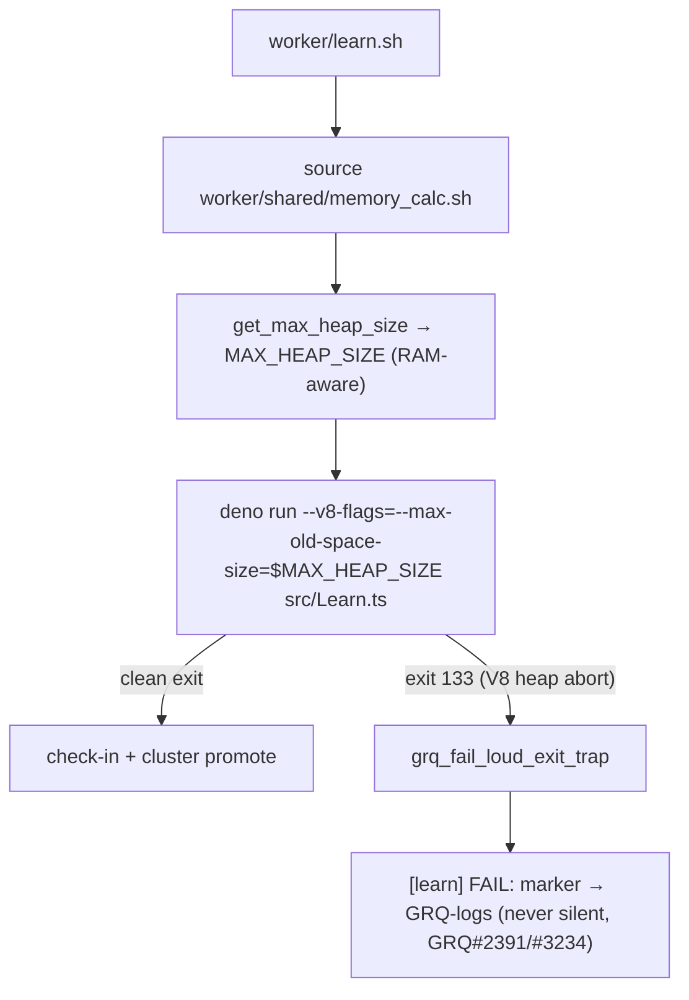

# wasm64 lane (d): GRQ learn-invocation wiring + 8 GB-host verification

Milestone [#295](https://github.com/stSoftwareAU/NEAT-AI-core/issues/295),
lane (d) — Issue
[#299](https://github.com/stSoftwareAU/NEAT-AI-core/issues/299). Motivating OOME:
[GRQ#3508](https://github.com/stSoftwareAU/GRQ/issues/3508) (learn-stage exit-133
on the 8 GB GRQ-21 host).

## Purpose

Lanes (a)/(b)/(c) established **what** to ship; lane (d) verifies the GRQ-side
**wiring** end-to-end and records the outcome:

- **Lane (a) (#296):** the ~4 GB learn ceiling is the **V8 old-space heap**
  (exit 133 / "Reached heap limit"), liftable by
  `--v8-flags=--max-old-space-size=<N>` — *not* the wasm32 4 GiB linear-memory
  wall.
- **Lane (b) (#297):** a wasm64 build is feasible only on the raw
  nightly + `-Z build-std` path (wasm-bindgen silently strips exports), so
  wasm64 is **not adopted yet**.
- **Lane (c) (#298):** `wasm_dataset` moves the large training arrays **off the
  JS heap** into neat-core's own linear memory (the residual-growth fix), with
  the `Learn.ts` adoption owned upstream by
  [NEAT-AI#3410](https://github.com/stSoftwareAU/NEAT-AI/issues/3410).

Lane (d) confirms GRQ's learn invocation selects the heap flag **RAM-aware** and
fails **loud** on a heap abort, and records the 8 GB-host verification status.

## End-to-end wiring (as shipped in GRQ)



The three wiring facts, each already present in `stSoftwareAU/GRQ` on `Develop`:

1. **RAM-aware heap flag.** `worker/learn.sh` sources
   `worker/shared/memory_calc.sh`, which exports `MAX_HEAP_SIZE` from
   `get_max_heap_size`, and injects
   `--v8-flags=--max-old-space-size=${MAX_HEAP_SIZE}` into the
   `deno run … src/Learn.ts` argv (the `BEGIN_LEARN_DENO_ARGV_2950` block).
   Sizing is `clamp((available − 1536) × 65%, floor(total) .. 24576)` MB.
2. **Constrained-host guard (#3342).** The 8 GB-tier floor steps **down** on a
   host whose *available* RAM is low (capped at 45% of available, never below
   1536 MB), so a fixed 3072 MB floor can never over-commit a constrained 8 GB
   host — the GRQ-26 crash class.
3. **Silent-failure guard (GRQ#2391 / Issue #3234).** learn.sh sets
   `GRQ_FAIL_LOUD_TASK=learn` and `trap grq_fail_loud_exit_trap EXIT`
   (`worker/shared/stage_fail_marker.sh`), so a native V8 heap abort (exit 133,
   which cannot print its own marker) still emits a `[learn] FAIL:` line and is
   never downgraded to success by node.sh.

## Verified: RAM-aware selection (lock-step with GRQ)

The neat-core acceptance model
[`tests/perf/learn_flags_wiring.ts`](../../tests/perf/learn_flags_wiring.ts)
re-derives the GRQ selection and is asserted by
[`tests/perf/learn_flags_wiring_test.ts`](../../tests/perf/learn_flags_wiring_test.ts)
(13 "what" tests). The model's numbers were cross-checked against GRQ's **real**
`worker/shared/memory_calc.sh` (Deno 2.9.0 host):

| Host (total / available) | `--max-old-space-size` (model) | `memory_calc.sh` (production) | Heap + 1536 headroom ≤ total? |
| --- | --- | --- | --- |
| 4 GB / 4096 MB | **1664** | 1664 | 3200 ≤ 4096 ✓ |
| 8 GB / 8192 MB | **4326** | 4326 | 5862 ≤ 8192 ✓ |
| 8 GB / 3865 MB (constrained) | **1739** | 1739 | 3275 ≤ 8192 ✓ |
| 16 GB / 16384 MB | **9651** | 9651 | 11187 ≤ 16384 ✓ |
| 64 GB / 65536 MB | **24576** (capped) | 24576 | 26112 ≤ 65536 ✓ |
| 2 GB / 2048 MB | **1536** (floor) | 1536 | — (below the 4 GB support tier) |

Invariants the tests pin — the acceptance criterion *"flags are RAM-aware (no
regression / new OOME on smaller hosts)"*:

- **Budget-fit:** on every supported tier (4/8/16/32/64 GB) the selected heap
  plus the FFI/OS headroom fits within the host's **total** RAM.
- **Monotonic:** heap never decreases as RAM grows — a smaller host is never
  sized above a larger one.
- **Safe fall-back below 8 GB:** a 4 GB host keeps the 1536 MB global floor and
  does **not** inherit the 8 GB tier's 3072 MB floor.
- **Silent-failure guard:** a marker-less exit-133 yields a `[learn] FAIL:`
  marker; a clean or already-marked exit stays silent.

The authoritative CI gate for the production selector remains GRQ's own
`test/worker/MemoryCalcHeapSize.ts` / `MemoryCalcHostFloor.ts`; this model is the
neat-core-side lock-step check so a GRQ formula drift is visible from the
milestone repo too.

## 8 GB-host end-to-end status

- **GRQ#3508 is closed `COMPLETED`.** The GRQ-side containment (RAM-aware heap +
  the #3342 constrained-8 GB step-down + the fail-loud marker) is shipped on
  `Develop`; the fleet owns the live GRQ#3508 job re-run on an 8 GB host.
- **Residual heap growth** (why an 8 GB host cannot simply be given a larger
  heap — 4326 MB is already ~all an 8 GB host can back) is addressed by lane
  (c)'s `wasm_dataset` offload, whose `Learn.ts` adoption + `MemoryMonitor` fix
  are **upstream** in NEAT-AI#3410. That fix reaches GRQ through the ordinary
  released-dependency bump (Issue #1613) once NEAT-AI#3410 lands and is
  released — it is **not** pulled in via a raw commit/pre-release (Issue #2944).
- **Not fabricated here:** a live 8 GB fleet-host run of the GRQ#3508 job class
  requires the full GRQ cluster environment and is fleet/human-owned; it is
  recorded as the remaining confirmation rather than simulated.

## Reproduce

```bash
# neat-core acceptance model (this repo)
deno test tests/perf/learn_flags_wiring_test.ts

# cross-check against GRQ's real selector (in a GRQ checkout)
bash -c 'source worker/shared/memory_calc.sh
  get_total_memory_gb(){ echo 8; }; get_available_memory_mb(){ echo 8192; }
  get_max_heap_size'   # → 4326
```
