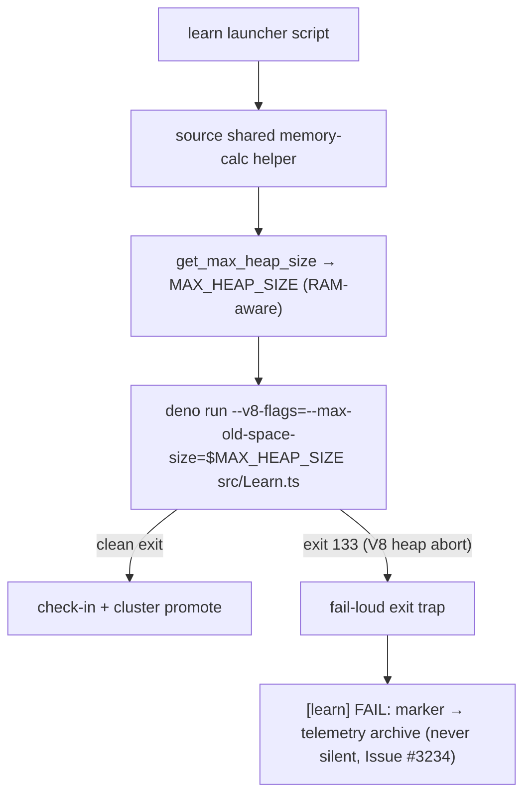

# wasm64 lane (d): learn-invocation wiring + 8 GB-host verification

Milestone [#295](https://github.com/stSoftwareAU/NEAT-AI-core/issues/295),
lane (d) — Issue
[#299](https://github.com/stSoftwareAU/NEAT-AI-core/issues/299). Motivating OOME:
a learn-stage **exit-133** V8 heap-limit abort observed on an 8 GB production
host in the downstream production training system.

> **Superseded in part — lane (c)'s artefact was removed.** The `wasm_dataset`
> training-data offload this document referred to as a live delivery path was
> **removed as dead code in Issue #415**: the `Learn.ts` adoption was never
> done, and the milestone and its upstream adoption issue both closed with the
> seven `training_data_*` exports unbound. The authoritative record is
> [README.md § Training-data offload (WASM linear memory) — removed, Issue #415](../../README.md#training-data-offload-wasm-linear-memory--removed-issue-415).
> The lane (d) verification content below — the `learn_flags_wiring.ts`
> invariants and the RAM-aware selection table — is unaffected and still current.

## Purpose

Lanes (a)/(b)/(c) established **what** to ship (lane (c)'s shipped artefact was
later removed — see the note above); lane (d) verifies the downstream-side
**wiring** end-to-end and records the outcome:

- **Lane (a) (#296):** the ~4 GB learn ceiling is the **V8 old-space heap**
  (exit 133 / "Reached heap limit"), liftable by
  `--v8-flags=--max-old-space-size=<N>` — *not* the wasm32 4 GiB linear-memory
  wall.
- **Lane (b) (#297):** a wasm64 build is feasible only on the raw
  nightly + `-Z build-std` path (wasm-bindgen silently strips exports), so
  wasm64 is **not adopted yet**.
- **Lane (c) (#298) — shipped, then removed:** `wasm_dataset` *moved* the large
  training arrays **off the JS heap** into neat-core's own linear memory (the
  proposed residual-growth fix). Its `Learn.ts` adoption, owned upstream by
  [NEAT-AI#3410](https://github.com/stSoftwareAU/NEAT-AI/issues/3410), was never
  done; that issue closed unadopted and the module was **removed in Issue #415**
  (see the note above).

Lane (d) confirms the downstream learn invocation selects the heap flag
**RAM-aware** and fails **loud** on a heap abort, and records the 8 GB-host
verification status.

## End-to-end wiring (as shipped downstream)



The three wiring facts, each already present in the downstream production
training system on `Develop`:

1. **RAM-aware heap flag.** The learn launcher sources a shared memory-calc
   helper, which exports `MAX_HEAP_SIZE` from `get_max_heap_size`, and injects
   `--v8-flags=--max-old-space-size=${MAX_HEAP_SIZE}` into the
   `deno run … src/Learn.ts` argv. Sizing is
   `clamp((available − 1536) × 65%, floor(total) .. 24576)` MB.
2. **Constrained-host guard.** The 8 GB-tier floor steps **down** on a host
   whose *available* RAM is low (capped at 45% of available, never below
   1536 MB), so a fixed 3072 MB floor can never over-commit a constrained 8 GB
   host — the constrained-8 GB crash class.
3. **Silent-failure guard (Issue #3234).** The launcher sets a fail-loud task
   marker and traps the exit, so a native V8 heap abort (exit 133, which cannot
   print its own marker) still emits a `[learn] FAIL:` line and is never
   downgraded to success by the production launcher.

## Verified: RAM-aware selection (lock-step with downstream)

The neat-core acceptance model
[`tests/perf/learn_flags_wiring.ts`](../../tests/perf/learn_flags_wiring.ts)
re-derives the downstream selection and is asserted by
[`tests/perf/learn_flags_wiring_test.ts`](../../tests/perf/learn_flags_wiring_test.ts)
(13 "what" tests). The model's numbers were cross-checked against the production
**real** memory-calc helper (Deno 2.9.0 host):

| Host (total / available) | `--max-old-space-size` (model) | production selector | Heap + 1536 headroom ≤ total? |
| --- | --- | --- | --- |
| 4 GB / 4096 MB | **1664** | 1664 | 3200 ≤ 4096 ✓ |
| 8 GB / 8192 MB | **4326** | 4326 | 5862 ≤ 8192 ✓ |
| 8 GB / 3865 MB (constrained) | **1739** | 1739 | 3275 ≤ 8192 ✓ |
| 16 GB / 16384 MB | **9651** | 9651 | 11187 ≤ 16384 ✓ |
| 64 GB / 65536 MB | **24576** (capped) | 24576 | 26112 ≤ 65536 ✓ |
| 2 GB / 2048 MB | **1536** (floor) | 1536 | — (below the 4 GB support tier) |

Invariants the tests pin — the acceptance criterion *"flags are RAM-aware (no
regression / new OOME on smaller hosts)"*:

- **Budget-fit:** on every supported tier (4/8/16/32/64 GB) the selected heap
  plus the FFI/OS headroom fits within the host's **total** RAM.
- **Monotonic:** heap never decreases as RAM grows — a smaller host is never
  sized above a larger one.
- **Safe fall-back below 8 GB:** a 4 GB host keeps the 1536 MB global floor and
  does **not** inherit the 8 GB tier's 3072 MB floor.
- **Silent-failure guard:** a marker-less exit-133 yields a `[learn] FAIL:`
  marker; a clean or already-marked exit stays silent.

The authoritative CI gate for the production selector remains the downstream
system's own memory-calc heap-size / host-floor tests; this model is the
neat-core-side lock-step check so a downstream formula drift is visible from the
milestone repo too.

## 8 GB-host end-to-end status

- **The motivating OOME is closed as completed.** The downstream containment
  (RAM-aware heap + the constrained-8 GB step-down + the fail-loud marker) is
  shipped on `Develop`; the fleet owns the live job re-run on an 8 GB host.
- **Residual heap growth** (why an 8 GB host cannot simply be given a larger
  heap — 4326 MB is already ~all an 8 GB host can back) was to have been
  addressed by lane (c)'s `wasm_dataset` offload, whose `Learn.ts` adoption +
  `MemoryMonitor` fix sat **upstream** in NEAT-AI#3410. Neither landed:
  NEAT-AI#3410 closed unadopted and the module was **removed in Issue #415**, so
  **no delivery path for this residual is open** — nothing downstream is waiting
  on a released-dependency bump. Re-adopting the offload means re-landing the
  module against a live consumer, per the README record linked above.
- **Not fabricated here:** a live 8 GB fleet-host run of the failing job class
  requires the full production cluster environment and is fleet/human-owned; it
  is recorded as the remaining confirmation rather than simulated.

## Reproduce

```bash
# neat-core acceptance model (this repo)
deno test tests/perf/learn_flags_wiring_test.ts

# cross-check against the downstream real selector (in a production checkout)
bash -c 'source <shared memory-calc helper>
  get_total_memory_gb(){ echo 8; }; get_available_memory_mb(){ echo 8192; }
  get_max_heap_size'   # → 4326
```
