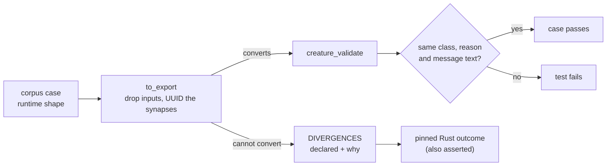

# 🧾 Vendored `creatureValidate` conformance corpus

These JSON files are **copied verbatim from NEAT-AI** and are the executable
description of what `src/architecture/CreatureValidate.ts` does today. They are
replayed against this crate's `creature_validate` by
`neat-core/tests/creature_validate_conformance.rs` (Issue #562).

> [!IMPORTANT]
> Do not edit these files here. They describe NEAT-AI's behaviour; a case that
> disagrees with `creature_validate` is either a port bug in this crate or a
> deliberate, declared divergence — never a fixture to relax. Changing a rule
> means changing the rule and re-vendoring the corpus, in a change that says so.

## 📌 Provenance

| | |
|---|---|
| Source repository | [`stSoftwareAU/NEAT-AI`](https://github.com/stSoftwareAU/NEAT-AI) |
| Source path | `test/fixtures/validate/` |
| Commit | `dce35fad87868aa8cb3fc91fc44f0ca9841216f7` |
| Branch | `milestone/3800-move-creature-validation-into-neat-ai-core-as` |
| Introduced by | NEAT-AI [#3801](https://github.com/stSoftwareAU/NEAT-AI/issues/3801) via PR [#3804](https://github.com/stSoftwareAU/NEAT-AI/pull/3804) (merge `4160c2fb6d4ec1cb97839242eb464266ab29a33f`) |
| Vendored | 2026-08-21 |

Checksums of the vendored bytes, so a silent edit here is visible:

```text
35b43e4f0408a72ca6cc787f5d3e8b264923b1a6a76c62f61a1f1a95dc13326d  coverage.json
938435b4d33cd8af5bafa67a86ca72d87087bbeb026ee0ebf12a5fb2e9a146d2  forward-only.json
1a7199583a33c9352e2f86b582a274c6fc2dc4b1edab8e4dc8b911ad16b64173  happy-paths.json
613e7cdf8712b35da10cd00733095bcb758aad202a5a57c8bbe13a069ebe5023  if-squash.json
9877aefd9975eddf70f91ee5d8d85aa6892fd27944aecbc5bef97c67264aa9ae  memetic.json
b3388a84ad5d89cd67750b80c5cb194443a44531b72f7e6cc64d6debb80cee88  neuron-identity.json
bd4079fac623924cef586c49f35f78009ea2cdf7da97a36fa755adcb823023fb  neuron-ordering.json
ba27e2f031978dede9ad6c18d557d01e77b6343f817ed350af992305ae6c5ed7  options-and-counts.json
23c3fbfa9391168e1b88e3dcd85ca57de55acc56bafaef48bc3ffe6a1cc35610  per-type-rules.json
04087020b07ff799a6333d8a3da63ab3747a13539b3dd6379fae4ce9117df000  synapses.json
```

Re-vendor with (from a NEAT-AI checkout at the recorded commit):

```bash
cp test/fixtures/validate/*.json <neat-ai-core>/neat-core/tests/fixtures/creature_validate/
```

…then update the commit and checksums above, and run
`cargo test -p neat-core --test creature_validate_conformance`.

## 🧬 What is in here

| File | Pins |
|------|------|
| `coverage.json` | the manifest: every validation site in `CreatureValidate.ts`, in source order, with its status (`covered`, `shadowed`, `not-expressible`) |
| `options-and-counts.json` | the options bag and the declared input / output widths |
| `neuron-identity.json` | ids, duplicate ids, non-finite biases |
| `neuron-ordering.json` | outputs last, inputs first, constants before hiddens |
| `if-squash.json` | the three `IF` roles and the inward-degree floor |
| `per-type-rules.json` | what each neuron type may and may not be wired to |
| `synapses.json` | sort order, duplicates, self and recursive synapses |
| `forward-only.json` | the extra leg a `forwardOnly` creature runs |
| `memetic.json` | memetic biases and weights resolving to real neurons and synapses |
| `happy-paths.json` | creatures that break no rule, pinned by their exact `stats` |

Two JSON conventions carry values JSON has no literal for, and the Rust runner
honours both: `null` (or an absent key) is `undefined`, and `"NaN"` /
`"Infinity"` / `"-Infinity"` are the matching non-finite numbers.

## 🔀 The two creature shapes

The corpus describes creatures in NEAT-AI's **runtime** shape — every neuron
listed, inputs included, integer ids, integer `from` / `to`. This crate
validates the **wire** shape (`CreatureExport`): input neurons are implicit,
neurons are named by UUID, and ids are derived by the loader before any rule
runs. `to_export` in the Rust runner is the single adapter between them.



Ten of the 47 cases describe something the wire shape cannot express — a
non-integer count serde rejects before any rule runs, an input neuron carrying
its own id, the host-only `neuron.index` check. None is skipped: each is
declared in `DIVERGENCES` in the runner with why it diverges *and* what this
crate does instead, and that behaviour is asserted too. Both a stale
declaration and a changed outcome fail the test.
