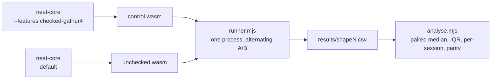

# wasm-bench — WASM A/B harness (Issue #509)

Measures a `wasm32`-only change against its control **inside a real wasm
runtime**, which the native Criterion harness cannot do. Built for the Issue 509
`gather4` prototype; reusable for any future wasm kernel change.

Deliberately **outside** the root virtual workspace (`exclude`d there, empty
`[workspace]` here): it is research tooling, not shipped code, so `quality.sh`,
the version-bump job and `cargo deny` see exactly the crate set they saw before.

## Why it is shaped like this

The host is shared and often loaded. Timing two separate processes gave ±3×
spreads and contradictory answers (median said faster, minimum said slower). So
the driver instantiates **both modules in one process** and alternates between
them sample by sample, flipping the order each sample; the statistic is the
**paired ratio** `unchecked / control`. Machine noise then hits both variants
equally and largely cancels.



## Running

```bash
# ./run.sh [samples] [shape-index] [records] [sessions]
#   shape-index indexes NETWORKS in neat-core/benches/common/mod.rs:
#   3 = production, 4 = production_2x, 5 = production_exact
./run.sh 25 5 4096 5
```

Fixtures come from `neat-core/benches/common/mod.rs` verbatim, so the creature
and records are the ones the committed Criterion baseline uses. Three
benchmarks: `kernel` (isolated `weighted_sum_simd`), `activate` (end-to-end
single-record inference) and `score` (end-to-end batched scoring, which does
*not* use `gather4` and so acts as the no-regression check). Each sample also
returns an `f64` checksum, so `analyse.mjs` reports numerical parity alongside
the timings.

## Running the wasm-only tests

`neat-core`'s own test targets cannot be built for wasm — its `criterion`
dev-dependency refuses to compile for wasi. This crate re-points the SIMD parity
tests (see the `[[test]]` entries in `Cargo.toml`) so they execute under Node's
WASI on `wasm32-wasip1`:

```bash
RUSTFLAGS="-C target-feature=+simd128,+relaxed-simd" \
CARGO_TARGET_WASM32_WASIP1_RUNNER="node $PWD/wasi-test-runner.mjs" \
  cargo test --target wasm32-wasip1 --release --target-dir ../target/wasm-bench/test

# …and the same tests against the bounds-checked control:
RUSTFLAGS="-C target-feature=+simd128,+relaxed-simd" \
CARGO_TARGET_WASM32_WASIP1_RUNNER="node $PWD/wasi-test-runner.mjs" \
  cargo test --target wasm32-wasip1 --release --features checked-gather4 \
    --target-dir ../target/wasm-bench/test-checked
```

Requires `rustup target add wasm32-unknown-unknown wasm32-wasip1` and Node ≥ 20
(relaxed SIMD). Results land in `results/` (gitignored); build artefacts go to the repo-level
`target/wasm-bench/`, so no repo-wide scan has to walk them.
