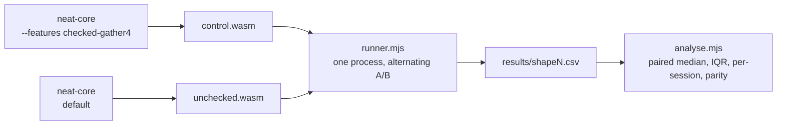

# wasm-bench — WASM A/B harness (Issue #509)

Measures a `wasm32`-only change against its control **inside a real wasm
runtime**, which the native Criterion harness cannot do. Built for the Issue 509
`gather4` prototype; reusable for any future wasm kernel change.

Deliberately **outside** the root virtual *build* workspace (`exclude`d there,
empty `[workspace]` here): it is research tooling, not shipped code, so the
workspace build and the version-bump job see exactly the crate set they saw
before.

Its **supply chain is in scope** (Issue #607): the lockfile this crate resolves
for itself is audited, denied and bumped like the root one. The per-lockfile
wiring lives once, in
[`SECURITY.md`](../SECURITY.md#supply-chain-audit-scope).

## Why it is shaped like this

The host is shared and often loaded. Timing two separate processes gave ±3×
spreads and contradictory answers (median said faster, minimum said slower). So
the driver instantiates **both modules in one process** and alternates between
them sample by sample, flipping the order each sample; the statistic is the
**paired ratio** `unchecked / control`. Machine noise then hits both variants
equally and largely cancels.


```mermaid
flowchart LR
    C["neat-core<br/>--features checked-gather4"] --> CW["control.wasm"]
    U["neat-core<br/>default"] --> UW["unchecked.wasm"]
    CW --> R["runner.mjs<br/>one process, alternating A/B"]
    UW --> R
    R --> CSV["results/shapeN.csv"]
    CSV --> A["analyse.mjs<br/>paired median, IQR, per-session, parity"]
```

## Running

```bash
# ./run.sh [samples] [shape-index] [records] [sessions]
#   shape-index indexes NETWORKS in neat-core/benches/common/mod.rs:
#   3 = production, 4 = production_2x, 5 = production_exact
./run.sh 25 5 4096 5
```

All four positionals must be non-negative integers: each is forwarded to
`runner.mjs` and `shape-index` also builds the `results/shape<N>.csv` path, so
`run.sh` rejects anything else with exit 2 before it touches the toolchain
(Issue #608). `tests/scripts/wasm_bench_run.bats` is the gate.

Fixtures come from `neat-core/benches/common/mod.rs` verbatim, so the creature
and records are the ones the committed Criterion baseline uses. Three
benchmarks: `kernel` (isolated `weighted_sum_simd_unchecked` — the hot-path
form the forward pass calls, Issue #613), `activate` (end-to-end
single-record inference) and `score` (end-to-end batched scoring, which does
*not* use `gather4` and so acts as the no-regression check). Each sample also
returns an `f64` checksum, so `analyse.mjs` reports numerical parity alongside
the timings.

## FFI panic safety (Issue #736)

Panics unwinding across a Rust `extern "C"` FFI boundary are undefined
behaviour. The harness guards all public exports against panicking on misuse —
invalid fixture shape, missing fixture state, out-of-bounds indexing — by using
`std::panic::catch_unwind` to catch panics and return sentinel values instead:

- **`u32` exports** (`setup`, `neuron_count`, `input_count`, `record_count`,
  `seed_activations`) return **`0xFFFFFFFF`** on panic or validation failure
- **`f64` exports** (`bench_kernel`, `bench_activate`, `bench_score`) return
  **`NaN`** on panic or validation failure

The JavaScript driver (`runner.mjs`) fails loud on either sentinel, throwing an
error that names the export and references Issue #736. A user error (invalid
shape or missing state) is caught early and reported as a clear error rather
than undefined behaviour; a defect in the harness is still caught and named.

`catch_unwind` only catches on an unwinding target — the native `cargo test`
build, where the guard is pinned by tests that drive a real panic through it.
`wasm32-unknown-unknown` builds with `panic = "abort"`, so there a panic that
escapes validation traps the instance (the runtime surfaces it as an error)
rather than returning a sentinel; the sentinels on wasm come from the
validation paths, which return `None` before any panic can occur.

**Breaking change:** The `seed_activations()` signature changed from `-> ()`
(void) to `-> u32` (status code) to report success or failure. Existing callers
must check the return value. See `src/lib.rs` for details on the sentinel
approach and the guarded-call helper pattern.

## Running the wasm-only tests

`neat-core`'s own test targets cannot be built for wasm — its `criterion`
dev-dependency refuses to compile for wasi. This crate re-points the SIMD parity
tests (see the `[[test]]` entries in `Cargo.toml`) so they execute under Node's
WASI on `wasm32-wasip1`:

```bash
RUSTFLAGS="-C target-feature=+simd128,+relaxed-simd" \
CARGO_TARGET_WASM32_WASIP1_RUNNER="node $PWD/wasi-test-runner.mjs" \
  cargo test --target wasm32-wasip1 --release --target-dir ../target/wasm-bench/test

# …and the same tests against the bounds-checked control:
RUSTFLAGS="-C target-feature=+simd128,+relaxed-simd" \
CARGO_TARGET_WASM32_WASIP1_RUNNER="node $PWD/wasi-test-runner.mjs" \
  cargo test --target wasm32-wasip1 --release --features checked-gather4 \
    --target-dir ../target/wasm-bench/test-checked
```

Requires `rustup target add wasm32-unknown-unknown wasm32-wasip1` and Node ≥ 20
(relaxed SIMD). Results land in `results/` (gitignored); build artefacts go to the repo-level
`target/wasm-bench/`, so no repo-wide scan has to walk them.
